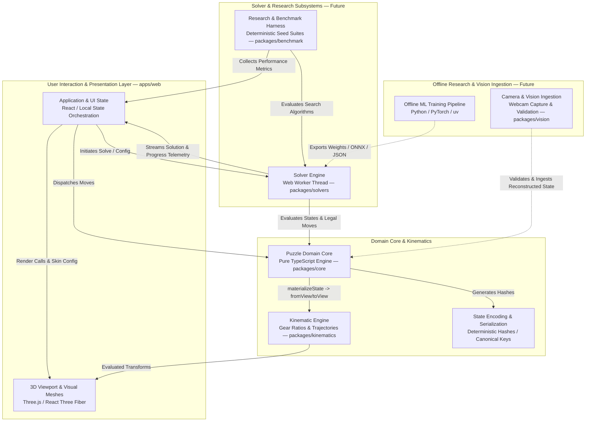

# SYSTEM_ARCHITECTURE.md — System Architecture & Component Contracts

> **Document Status:** `DECIDED`
> **Target System:** GearCube Lab Web Application & Research Framework

---

## 1. Architectural Principles & Boundaries

GearCube Lab is architected around strict unidirectional layer isolation. The domain core represents the pure mathematical truth of the puzzle, completely decoupled from rendering frameworks, UI component libraries, and browser APIs.

### Core Architecture Axioms:
1. **Unidirectional Dependency Direction:**
   $$\text{UI} \longrightarrow \text{Renderer} \longrightarrow \text{Kinematics} \longrightarrow \text{Core}$$
   $$\text{Solvers} \longrightarrow \text{Core}$$
   $$\text{Benchmark} \longrightarrow \text{Solvers} \longrightarrow \text{Core}$$
2. **Zero Core Framework Coupling:**
   The Puzzle Domain Core has zero dependencies on React, Three.js, R3F, Zustand, Web APIs, DOM, or ML frameworks.
3. **Renderer Independence:**
   The 3D Scene Graph and mesh instances reflect state; they never own, mutate, or calculate puzzle state transitions.
4. **Thread Boundary Isolation:**
   Expensive combinatorial search algorithms execute outside the browser UI/main thread in background Web Workers so that solving does not directly block rendering or interaction.

---

## 2. High-Level System Architecture Diagram



---

## 3. Layer Breakdown & Component Responsibilities

### 3.1. Puzzle Domain Core (`packages/core`)
- **Responsibilities:**
  - Defines the discrete representation of the Standard Gear Cube structured around natural orbit coordinates (corners in $S_4$, 3 edge slices in $V_4 \times \mathbb{Z}_3$; detailed in [`GEAR_CUBE_STATE_MODEL.md`](GEAR_CUBE_STATE_MODEL.md)).
  - Validates move legality (strictly directed $180^\circ$ face flips).
  - Applies discrete state transitions: $\text{State}_{t+1} = \text{applyMove}(\text{State}_t, \text{Move})$.
  - Computes deterministic string serialization and exports derived materialized piece views via `materializeState()`.
  - Checks solved-state criteria and group invariants.
- **Prohibited Dependencies:** Zero runtime dependencies. No Three.js, React, DOM, or node-specific built-ins.

### 3.2. Kinematic Engine (`packages/kinematics`)
- **Responsibilities:**
  - Converts physical piece placement views `(fromView, move, toView)` into continuous kinematic trajectories parameterized by normalized mechanical progress $p \in [0, 1]$ pursuant to [`ADR-0006`](../decisions/ADR-0006-VIEW-BASED-KINEMATICS-AND-RENDERER-QUOTIENTS.md) and [`KINEMATIC_CONTRACT.md`](KINEMATIC_CONTRACT.md).
  - Computes exact coupled angular displacements:
    - Outer face: $180^\circ \cdot p$
    - Middle slice: $90^\circ \cdot p$
    - Intermediate gear cogs: $60^\circ \cdot p$
  - Generates evaluated rigid-body component transforms for smooth 3D animation.
- **Prohibited Dependencies:** Does not depend on WebGL rendering contexts, Three.js meshes, React, or DOM elements.

### 3.3. 3D Renderer & View (`apps/web/src/components/**` — Conceptual View Layer)
- **Responsibilities:**
  - Manages the Three.js scene graph, lights, orbital camera, and mesh instancing inside `apps/web` (e.g. `GearCubeViewport.tsx`, `GearCubeModel.tsx`, procedural piece meshes, and materials).
  - Implements interchangeable visual skins and face sticker materials.
  - Consumes Kinematic Plans and ComponentTransforms to position 3D meshes along calculated trajectories.
  - Maintains zero puzzle state authority: rendering is strictly downstream of domain state and kinematic projections.
- **Topology Note:** Implemented directly within `apps/web/src/components/` rather than as an isolated `packages/renderer` package; maintains strict layer separation by consuming domain projections internally from `@gearcube/core` and `@gearcube/kinematics` alongside presentation framework dependencies (React, React Three Fiber, Three.js).

### 3.4. Application & UI State (`apps/web` — Conceptual Presentation Layer)
- **Responsibilities:**
  - Orchestrates interactive application UI, controls, and presentation lifecycle.
  - Manages single authoritative session state (`GearCubeSessionState` in `apps/web/src/components/cube/animation.ts`) via React local state / pure transition functions.
  - Hosts planned Phase 3 extensions (canonical move history timeline, undo/redo stacks, and deterministic seeded scramble generator under `apps/web/src/components/history/**` — Planned Phase 3A) which wrap and reference canonical session snapshots without becoming a second puzzle authority.
  - Dispatches move requests to the Domain Core and initiates solver worker tasks.
  - Renders minimalist controls, solution playback bars, and telemetry metrics.
- **Topology Note:** Implemented directly within `apps/web` rather than as a separate `packages/ui` package; uses standard React presentation tools without external state-management libraries (no Zustand requirement for Phase 3). Project-internal workspace dependencies are limited to `@gearcube/core` and `@gearcube/kinematics`.

### 3.5. Solver Engine (`packages/solvers` — Future Phase 4)
- **Responsibilities:**
  - Hosts classical graph search algorithms (primary baselines: BFS, Bidirectional BFS, IDA*; optional candidates: IDDFS, A*, Pattern Databases).
  - Encapsulated within a Web Worker to run asynchronously off the main thread.
  - Reports periodic search telemetry (nodes expanded, search depth, elapsed time) via message passing.
- **Prohibited Dependencies:** Must not access DOM, window, or Three.js objects.

### 3.6. Research & Benchmark Harness (`packages/benchmark` — Future Phase 5)
- **Responsibilities:**
  - Executes batch automated search runs across predefined scramble seed suites.
  - Gathers statistical telemetry: time-to-solution, memory footprint, branch pruning factor, solution optimality.
  - Exports deterministic benchmark data in JSON and CSV formats for research documentation.

### 3.7. Offline ML Research Pipeline (`ml/` — Future Phase 6)
- **Responsibilities:**
  - Offline Python research environment managed exclusively with `uv` (exact Python version to be selected based on ML dependency compatibility).
  - Implements PyTorch neural networks for value estimation and policy guidance.
  - Exports trained weights in compact portable formats (e.g., JSON weights or ONNX) for browser worker inference.

### 3.8. Computer Vision Ingestion (`packages/vision` — Future Phase 7)
- **Responsibilities:**
  - Streams webcam video feed via WebRTC `getUserMedia`.
  - Segments face boundaries, classifies sticker colors, and detects gear orientations.
  - Reconstructs candidate `GearCubeState` and performs state consistency and reachability validation before ingestion into Core, allowing user corrections for ambiguous detections.

---

## 4. Cross-Cutting Concerns

### 4.1. Thread Boundary & Worker Communication
Communication between the UI main thread and the Solver Web Worker occurs exclusively via serializable JSON-compatible messages:

```
[ UI Thread ]  --- { type: 'START_SEARCH', state: GearCubeState, algorithm: 'IDA_STAR' } ---> [ Worker ]
[ UI Thread ]  <-- { type: 'SEARCH_PROGRESS', nodes: 14500, depth: 4, elapsedMs: 120 } <--- [ Worker ]
[ UI Thread ]  <-- { type: 'SEARCH_COMPLETE', solution: Move[], metrics: BenchmarkMetrics } - [ Worker ]
```

### 4.2. Error Handling & Invariant Violations
- Core operations throw strongly typed domain errors (e.g., `IllegalMoveError`, `InvalidStateError`).
- UI layer catches and translates domain errors into user-facing alerts without crashing the 3D viewport.
- Solver Worker catches out-of-memory or timeout conditions and gracefully reports failure states to the main thread.
