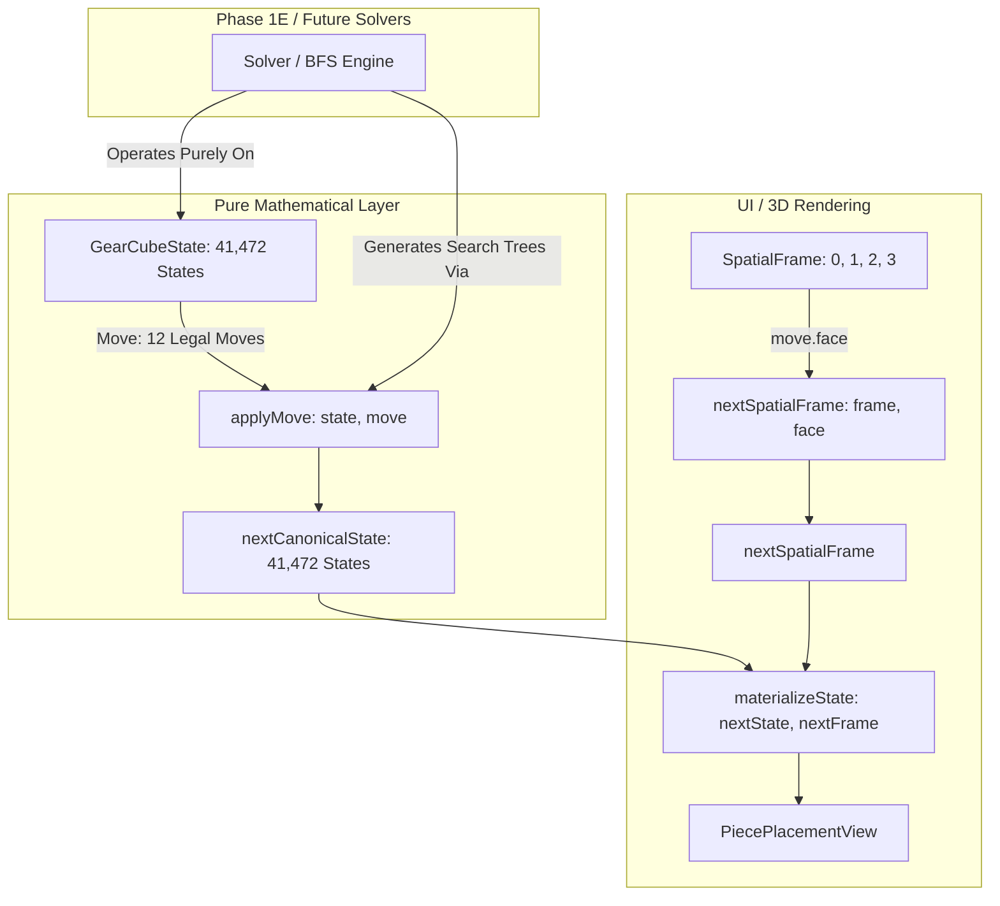

# ADR-0005 — Canonical Move Transition Algebra under Reference Normalization

> **Status:** `Accepted`
> **Date:** 2026-08-21
> **Decision Owners:** Architecture & Core Domain Group
> **Applicability:** Pure TypeScript Domain Core (`packages/core`), Transition Engine (`applyMove`), and Materialization Lifecycle

---

## 1. Context & Problem Statement

During independent verification of **Phase 1D (SpatialFrame / Materialization / Logical Serialization)**, an exhaustive application lifecycle verification gate revealed a fundamental architectural discrepancy between the Phase 1C canonical transition engine (`applyMove`), Phase 1D spatial frames (`SpatialFrame`), and 3D Euclidean physical rotation mechanics:

```text
               +-------------------------------------------------------------+
               |                    PROBLEM STATEMENT                        |
               |                                                             |
               |  Phase 1C implemented applyMove(state, move) using         |
               |  transition lookup tables in transition-data.ts that        |
               |  modeled corner turns as un-normalized body-fixed 2-cycles  |
               |  on T_free, implicitly assuming reference corner T_ref was  |
               |  fixed at canonical slot 3 (DBL at [-1, -1, -1]).           |
               +------------------------------+------------------------------+
                                              |
                                              v
               +-------------------------------------------------------------+
               |               CROSS-PHASE CONTRADICTION                     |
               |                                                             |
               |  1. Positive Faces (U, F, R): Reference corner piece 3      |
               |     (DBL) is not on these faces and remains unmoved.        |
               |     Phase 1C transitions match physical truth 100%          |
               |     across all 41,472 states x 4 frames x 6 moves.          |
               |                                                             |
               |  2. Negative Faces (D, B, L): Reference corner piece 3      |
               |     (DBL) relocates to DFR, UFL, or UBR, which induces a    |
               |     canonical reference-frame rotation Ry(pi), Rx(pi), or   |
               |     Rz(pi) to restore standard normalization.               |
               |                                                             |
               |  3. Phase 1C omitted this reference-rotation step for       |
               |     D, B, L tables. Consequently, 100% of D, B, L turns     |
               |     fail physical application lifecycle validation.         |
               +------------------------------+------------------------------+
```

---

## 2. Established Executable Evidence

The decisions in this ADR are grounded on exhaustive mathematical characterization across all $1,990,656$ application transitions ($41,472 \text{ states} \times 4 \text{ SpatialFrames} \times 12 \text{ directed moves}$):

### 2.1. Pair Transition Closure & Normalizability
- **Total Transitions Evaluated:** Exactly $1,990,656$.
- **Normalizable Outcomes:** Exactly **$1,990,656 / 1,990,656$** ($100.0\%$).
- **Invalid / Un-normalizable Transitions:** Exactly **$0$**.
- Every physical 3D rotation outcome from any canonical state and SpatialFrame normalizes bijectively into a valid $(s', f') \in \text{GearCubeState} \times \text{SpatialFrame}$. No state-space expansion is required.

### 2.2. Canonical Next-State Frame Independence
For every one of the $497,664$ unique $(\text{state}, \text{move})$ pairs, the resulting canonical state $s'$ derived via independent physical normalization was evaluated across all four initial SpatialFrames $\{0, 1, 2, 3\}$:

$$\text{oracleNextState}(s, f_0, m) \equiv \text{oracleNextState}(s, f_1, m) \equiv \text{oracleNextState}(s, f_2, m) \equiv \text{oracleNextState}(s, f_3, m)$$

- **Keys with exactly 1 unique `nextState` across all 4 frames:** **$497,664 / 497,664$** ($100.0\%$).
- **Keys with 2, 3, or 4 unique `nextStates`:** **$0 / 497,664$** ($0.0\%$).
- **Per-Move Breakdown (out of 41,472 states each):**
  - `U CW` / `U CCW`: $41,472 / 41,472$ frame-independent ($0$ dependent)
  - `D CW` / `D CCW`: $41,472 / 41,472$ frame-independent ($0$ dependent)
  - `F CW` / `F CCW`: $41,472 / 41,472$ frame-independent ($0$ dependent)
  - `B CW` / `B CCW`: $41,472 / 41,472$ frame-independent ($0$ dependent)
  - `R CW` / `R CCW`: $41,472 / 41,472$ frame-independent ($0$ dependent)
  - `L CW` / `L CCW`: $41,472 / 41,472$ frame-independent ($0$ dependent)

Therefore, the canonical state transition function $T: \text{GearCubeState} \times \text{Move} \to \text{GearCubeState}$ is globally well-defined without taking `SpatialFrame` as an input.

### 2.3. SpatialFrame Transition Invariance
- **Full Domain Evaluation:** Exactly $1,990,656 / 1,990,656$.
- **Production `nextSpatialFrame(frame, move.face)` Mismatches:** Exactly **$0$**.
- The 2-cycle frame transposition rules `FRAME_SWAPS` in `packages/core/src/spatial-frame.ts` are $100\%$ accurate across the full domain.

### 2.4. Existing Phase 1C `applyMove` Discrepancy Breakdown
Comparison between independent physical normalization and production `applyMove(state, move)` across all $1,990,656$ transitions:
- **Total Matches:** **$995,328 / 1,990,656$** ($50.0\%$).
- **Total Mismatches:** **$995,328 / 1,990,656$** ($50.0\%$).
- **Exact Per-Face Distribution (Across all 4 SpatialFrames):**
  - Positive Faces (`U`, `F`, `R`): **$41,472 / 41,472$ matches ($100.0\%$)** in every frame and direction.
  - Negative Faces (`D`, `B`, `L`): **$41,472 / 41,472$ mismatches ($100.0\%$)** in every frame and direction.

---

## 3. Decision: Canonical Move Transition Algebra under Reference Normalization

1. **Normative Definition of `applyMove`:**
   `applyMove(state: GearCubeState, move: Move): GearCubeState` is formally defined as the **closed reference-normalized canonical Gear Cube move transition function**.
   - It is **NOT** a raw un-normalized corner transposition primitive.
   - It is **NOT** a renderer or world-frame transformation.
   - It is **NOT** a SpatialFrame-dependent transition.
   - It is **NOT** an application pair-state transition.
2. **Domain & Cardinality Invariants:**
   $$\text{applyMove}: \text{GearCubeState} \times \text{Move} \to \text{GearCubeState}$$
   with canonical state space cardinality $|\mathcal{S}| = \mathbf{41,472}$ and the exact standard 12-move vocabulary ($\text{Face} \in \{U, D, F, B, R, L\} \times \text{Direction} \in \{\text{CW}, \text{CCW}\}$). The public function signature remains pure state-only.
3. **Negative-Face ($D, B, L$) Canonical Transition Correction:**
   The canonical move transition semantics for negative faces ($D, B, L$) MUST be harmonized with reference normalization. Corrected `applyMove` outputs for $D, B, L$ moves MUST match the independent normalized physical oracle across all $41,472$ canonical states and both rotation directions.
4. **Positive-Face ($U, F, R$) Semantic Non-Regression:**
   The canonical move transition semantics for positive faces ($U, F, R$) MUST remain behaviorally unchanged, with zero semantic regressions permitted across all $41,472$ canonical states and both rotation directions.

---

## 4. Architectural Boundaries: Domain Core, Solvers, and Presentation



### 4.1. Canonical & Solver Boundary
- **Canonical State Representation:** `GearCubeState` consists strictly of `{ cornerConfiguration, sliceX, sliceY, sliceZ }`.
- **Solver State Space:** Solvers (including the upcoming Phase 1E Reachable State Closure BFS) operate exclusively on `GearCubeState` and the 12 canonical moves via `applyMove`.
- **SpatialFrame Exclusion:** `SpatialFrame` is strictly excluded from `GearCubeState` and solver state spaces. Solvers do not track, store, or manipulate spatial frames.

### 4.2. Application Lifecycle Composition

#### 4.2.1. Normative Application Lifecycle Contract
For interactive applications, 3D renderers, and simulation environments, the presentation lifecycle is composed of two orthogonal, deterministic operations:
1. Canonical state evolution:
   $$\text{nextState} = \text{applyMove}(\text{state}, \text{move})$$
2. Fixed-spatial frame evolution:
   $$\text{nextFrame} = \text{nextSpatialFrame}(\text{frame}, \text{move.face})$$
3. Materialization:
   $$\text{nextView} = \text{materializeState}(\text{nextState}, \text{nextFrame})$$

SpatialFrame is presentation and rendering state, and is strictly excluded from canonical solver state.

#### 4.2.2. Current Implementation Status vs. Future Verification Gate
- **Current Production Status:** Current production does **NOT** yet satisfy this full lifecycle for negative faces ($D, B, L$), failing $995,328 / 1,990,656$ transitions ($50.0\%$) due to the un-harmonized Phase 1C transition data.
- **Established Mathematical Characterization:** Exhaustive empirical characterization proves that:
  1. Canonical `nextState` is 100% frame-independent across all $497,664$ $(\text{state}, \text{move})$ pairs.
  2. `nextSpatialFrame` is 100% geometrically accurate ($1,990,656 / 1,990,656$, $0$ mismatches).
  3. The reference-normalized canonical transition relation closes deterministically on `GearCubeState`.
- **Future Required Gate:** Following the cross-phase transition repair, production MUST satisfy the complete application lifecycle gate:
  $$\text{materializeState}(\text{applyMove}(s, m), \text{nextSpatialFrame}(f, m.\text{face})) \equiv \text{simPhysical}(\text{materializeState}(s, f), m)$$
  across all **$1,990,656 / 1,990,656$** transitions with **$0$ mismatches**. ADR-0005 adoption formalizes this requirement and does not itself imply that production is already green.

---

## 5. Mathematical Basis: Reference Normalization & Negative-Face Harmonization

### 5.1. Reference Normalization Mechanics (Jaap's Representation)
In `docs/architecture/GEAR_CUBE_STATE_MODEL.md`, the canonical corner configuration $C \in \{0 \dots 23\}$ is defined as the lexicographic permutation rank of free corners $T_{\text{free}} = (\text{UFR}, \text{UBL}, \text{DFL}, \text{DBR})$ in a coordinate system where reference corner piece $3$ (`corner-DBL`) is fixed at reference slot $3$ (`DBL` at $(-1, -1, -1)$).

1. **Positive-Axis Faces ($U, F, R$):**
   - Reference piece `DBL` $(-1, -1, -1)$ does not lie on faces $U$ ($y = +1$), $F$ ($z = +1$), or $R$ ($x = +1$).
   - Turning $U, F, R$ leaves piece `DBL` at $(-1, -1, -1)$. The coordinate system remains standard ($R = I$).
   - Phase 1C's localized 2-cycle corner transpositions on $T_{\text{free}}$ are exact.
2. **Negative-Axis Faces ($D, B, L$):**
   - Reference piece `DBL` $(-1, -1, -1)$ lies on faces $D$ ($y = -1$), $B$ ($z = -1$), and $L$ ($x = -1$).
   - Turning $D$ moves piece `DBL` to slot `DFR` $(+1, -1, +1)$, inducing reference rotation $R_y(\pi)$.
   - Turning $B$ moves piece `DBL` to slot `UBR` $(+1, +1, -1)$, inducing reference rotation $R_z(\pi)$.
   - Turning $L$ moves piece `DBL` to slot `UFL` $(-1, +1, +1)$, inducing reference rotation $R_x(\pi)$.
   - To restore the canonical reference normalization (where piece `DBL` is at slot `DBL`), the coordinate frame must be rotated by $R_y(\pi), R_z(\pi),$ or $R_x(\pi)$.
   - This coordinate transformation permutes the canonical slots of both $T_{\text{free}}$ corners and middle-slice edges $X, Y, Z$.
   - Phase 1C omitted this reference-rotation step, producing un-normalized body-fixed transitions for $D, B, L$.

---

## 6. Implementation Repair Hypothesis & Boundaries

The concrete implementation repair surface for the subsequent repair task is hypothesized as follows:

### 6.1. Implementation Hypothesis (Target Files & Data)
- `packages/core/src/transition-data.ts` (Hypothesized data repair):
  - `CORNER_TRANSITIONS`: Update rows for $D, B, L$ ($24$ values each) to reflect reference-normalized $T_{\text{free}}$ ranks.
  - `SLICE_K_TRANSITIONS`: Update tables for $D, B, L$ ($2 \times 3 \times 24 \times 4$ values) to reflect reference-normalized $V_4$ permutations.
- `packages/core/tests/transitions.test.ts`:
  - Update golden test vectors for $D, B, L$ moves to match the reference-normalized canonical oracle.

### 6.2. Architectural Invariants & Non-Regression Scope
- **$U, F, R$ Semantic Non-Regression:** Transition outputs for $U, F, R$ must remain 100% semantically identical to baseline across all $41,472$ states. (Preserving $U, F, R$ table data identical in `transition-data.ts` is the expected implementation mechanism).
- **Engine Logic & Algorithm Invariant:** `packages/core/src/transitions.ts` is hypothesized to require zero modifications.
- **Public API Contract Invariant:** Public TypeScript function signatures, types, and export counts remain 100% unchanged.

> [!IMPORTANT]
> If subsequent implementation reveals that the transition engine shape (`transitions.ts`) must change rather than table lookup data alone, work must immediately STOP for architecture re-review.

---

## 7. Independent Derivation Requirement

To prevent tautological test generation or circular verification, replacement transition tables for $D, B, L$ must be derived and verified using an independent reference pipeline:

```text
(canonicalState, frame = 3)
   │
   ▼  [1. Normative Materialization: T_ref, T_free, B_X, B_Y, B_Z, Model A]
PiecePlacementView
   │
   ▼  [2. 3D Euclidean Vector Rotation: ±180° / ±90° transforms]
nextPiecePlacementView
   │
   ▼  [3. Independent Geometric Normalization: track DBL piece -> frame -> inverse tables]
(expectedCanonicalState, expectedSpatialFrame)
```

Prohibited repair methods:
- ❌ Trial-and-error edits or tuning values until tests pass.
- ❌ Deriving test expected values from corrected production code.
- ❌ Copying production tables into the reference oracle.

---

## 8. Mandatory Post-Repair Acceptance Gates

The subsequent cross-phase transition repair task must satisfy the following falsifiable gates before acceptance:

| Gate ID | Scope & Target | Pass Condition |
| :--- | :--- | :--- |
| **`GATE_0005_PAIR_CLOSURE`** | $1,990,656$ application transitions | $1,990,656 / 1,990,656$ normalizable ($0$ errors). |
| **`GATE_0005_FRAME_INVARIANCE`** | $497,664$ canonical $(\text{state}, \text{move})$ pairs | $497,664 / 497,664$ produce identical `nextState` across all 4 frames ($0$ mismatches). |
| **`GATE_0005_POSITIVE_NON_REGRESSION`** | $U, F, R$ moves across $41,472$ states | $100\%$ identical to baseline Phase 1C transitions ($0$ regressions). |
| **`GATE_0005_NEGATIVE_CORRECTION`** | $D, B, L$ moves across $41,472$ states | $100\%$ match with independent normalized physical oracle ($0$ mismatches). |
| **`GATE_0005_CANONICAL_TRANSITIONS`** | $497,664$ canonical transitions | $\text{applyMove}(s, m) \equiv \text{oracleNextState}(s, m)$ ($0$ mismatches). |
| **`GATE_0005_APPLICATION_LIFECYCLE`** | $1,990,656$ lifecycle transitions | $\text{materialize}(\text{applyMove}(s, m), \text{nextSpatialFrame}(f, m.\text{face})) \equiv \text{simPhysical}(\text{materialize}(s, f), m)$ ($0$ mismatches). |
| **`GATE_0005_PHASE1C_REGRESSION`** | `packages/core/tests/transitions.test.ts` | All unit tests pass with updated $D, B, L$ golden vectors. |
| **`GATE_0005_PHASE1D_PRESERVATION`** | Phase 1D Model A, center identity, materialization, serialization | All Level 3 tests pass ($100\%$ green). |

---

## 9. Compatibility & Semantic Migration Classification

- **Public Types & Signatures:** **COMPATIBLE** (Zero breaking signature or type changes).
- **Public Export Count:** **COMPATIBLE** (Exact 53 public exports preserved).
- **State Representation & Cardinality:** **COMPATIBLE** ($41,472$ state cardinality preserved).
- **Move Vocabulary:** **COMPATIBLE** (Exact 12 canonical moves preserved).
- **Runtime Behavioral Semantics:** **INTENTIONALLY CORRECTED for $D, B, L$**.
- **Classification:** **`CORRECTNESS_FIX_WITH_BEHAVIOR_CHANGE`**
  - This is **NOT** an `API_BREAK` (signatures and types are identical).
  - This is **NOT** a `NO_BEHAVIOR_CHANGE` release.
  - Observable outputs for $D, B, L$ intentionally change because prior outputs violated reference normalization.

---

## 10. Historical Document Treatment & Phase 1D Plan Supersession

### 10.1. Exact Document Classifications

| Document Path | Lifecycle Classification | Normative Authority & Supersession Action |
| :--- | :---: | :--- |
| `docs/development/PHASE_1C_IMPLEMENTATION_PLAN.md` | **`HISTORICAL_PRESERVE`** | Preserved as an immutable historical design artifact. It is NOT retroactively rewritten. |
| `docs/development/PHASE_1D_IMPLEMENTATION_PLAN.md` | **`HISTORICAL_PRESERVE + FORWARD_SUPERSEDE_CONFLICTING_LIFECYCLE_SECTIONS`** | Preserved as an immutable historical Accepted planning artifact. Conflicting direct lifecycle sections are forward-superseded by ADR-0005. |
| `docs/architecture/GEAR_CUBE_STATE_MODEL.md` | **`UPDATE_REQUIRED`** | Section 8 is updated in a forward repair task to formalize reference-normalized move semantics. |
| `docs/development/ROADMAP.md` | **`UPDATE_REQUIRED`** | Updated to record ADR-0005 adoption and the dedicated cross-phase transition repair milestone. |
| `docs/development/TEST_STRATEGY.md` | **`UPDATE_REQUIRED`** | Updated to document the 497,664 canonical transition and 1,990,656 lifecycle verification gates. |
| `docs/architecture/PUZZLE_CONTRACTS.md` | **`AUDIT_THEN_UPDATE_IF_NEEDED`** | Audit post-decision to verify contract alignment. |
| `docs/architecture/KINEMATIC_CONTRACT.md` | **`AUDIT_THEN_UPDATE_IF_NEEDED`** | Audit post-decision to verify continuous kinematics alignment. |
| `docs/README.md` | **`AUDIT_THEN_UPDATE_IF_NEEDED`** | Audit post-decision for ADR indexing. |

### 10.2. Phase 1D Plan Supersession & Task Boundary Governance
1. **Preservation of Historical Record:** `docs/development/PHASE_1D_IMPLEMENTATION_PLAN.md` remains preserved as an immutable historical Accepted planning document. It must NOT be retroactively edited to pretend the prior direct lifecycle assumption was correct.
2. **Empirical Disproof & Forward Supersession:** Exhaustive empirical characterization disproved the Phase 1D plan's direct lifecycle assumption (`applyMove(s, m)` + `nextSpatialFrame(f, m.face)`) when paired with the un-harmonized Phase 1C $D, B, L$ transition algebra. Upon acceptance of ADR-0005, the conflicting lifecycle sections of `PHASE_1D_IMPLEMENTATION_PLAN.md` cease to be normative authority and are forward-superseded by ADR-0005 and a subsequent bounded recovery / superseding implementation plan.
3. **Preservation of Phase 1D Implementation Work:** The existing Phase 1D module implementation in `phase/1d-frame-materialization-implementation` (`spatial-frame.ts`, `materializer.ts`, `serialization.ts`, `index.ts`, `serialization.test.ts`, `materializer.test.ts`) is not implicated by the currently identified cross-phase transition defect. It remains preserved unchanged pending completion of the ADR-0005 transition repair and subsequent final independent Phase 1D acceptance (`PHASE1D_IMPLEMENTATION_STATUS: PRESERVED_PENDING_FINAL_INDEPENDENT_ACCEPTANCE`). It must NOT be discarded, reset, or prematurely claimed as already completed or accepted.
4. **Strict Scope Separation (No Silent Expansion):**
   - The original Phase 1D implementation task scope remains strictly bounded to Phase 1D modules.
   - Cross-phase repair files (`packages/core/src/transition-data.ts`, `packages/core/tests/transitions.test.ts`) must **NOT** be silently injected into the Phase 1D implementation task.
   - Cross-phase repair belongs to a separately authorized, dedicated ADR-0005 transition repair task.
   - Only after that cross-phase repair is independently verified and accepted may the preserved Phase 1D implementation worktree be resumed for final acceptance verification. Phase 1E remains strictly blocked until these prerequisites are satisfied.

---

## 11. Candidate Alternatives Considered

### Option A — Harmonize Canonical `applyMove` Transition Data [RECOMMENDED & ADOPTED]
- **Description:** Maintain the existing public signature `applyMove(state: GearCubeState, move: Move): GearCubeState`. Update lookup tables in `packages/core/src/transition-data.ts` for $D, B, L$.
- **Rationale:** Aligns with empirical frame-independence proof; preserves clean state-only transition algebra for solvers; preserves 53 public exports and exact type signatures; restores full application lifecycle consistency ($1,990,656 / 1,990,656$).

### Option B — Preserve Old Phase 1C Semantics & Add Secondary API [REJECTED]
- **Description:** Retain un-normalized Phase 1C transitions as a low-level primitive, adding `applyNormalizedMove` for applications.
- **Reason for Rejection:** Unnecessary complexity; un-normalized body-fixed transitions correspond to no physical or solver requirement; introduces severe public API ambiguity.

### Option C — Frame-Aware Application Transition [REJECTED]
- **Description:** Deprecate state-only transitions and require `applyPhysicalMove(state, frame, move): { state, spatialFrame }`.
- **Reason for Rejection:** Contradicted by empirical proof. Canonical `nextState` was proven 100% frame-independent across all $497,664$ keys. Forcing solvers to pass a dummy `SpatialFrame` violates Domain Core separation of concerns.

---

## 12. Stop Conditions

Execution must immediately STOP and report for architecture re-review if:
1. Mathematical characterization fails to replicate $100\%$ frame independence across the $497,664$ canonical state-move pairs.
2. Evidence suggests $U, F, R$ transitions require semantic alterations.
3. Repair requires expanding `GearCubeState` fields or modifying the $41,472$ state cardinality.
4. Repair requires introducing `SpatialFrame` into solver state representations.
5. Repair requires altering the public 12-move vocabulary (`FACES` or `DIRECTIONS`).
6. Repair requires retroactively rewriting historical Phase 1C planning documents.
7. Repair requires altering the transition engine algorithmic structure (`transitions.ts`) beyond table lookup data.
