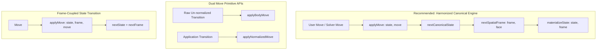
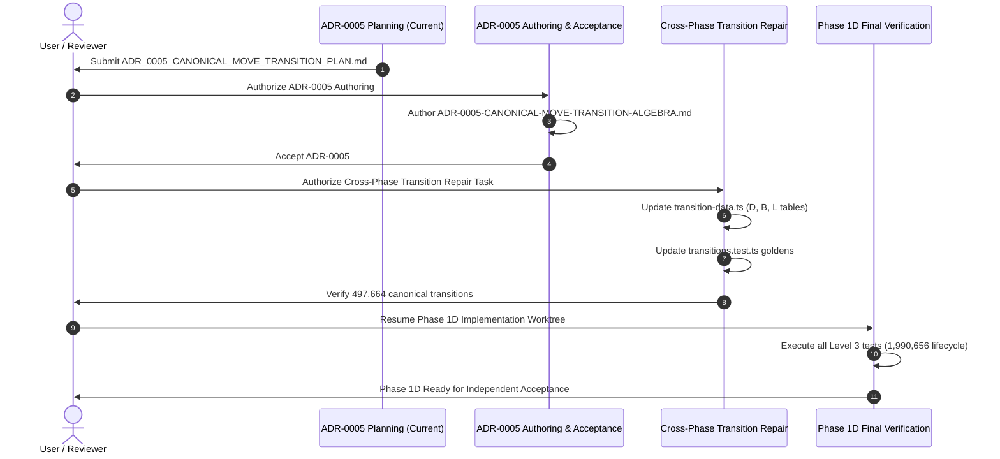

# ADR_0005_CANONICAL_MOVE_TRANSITION_PLAN.md — Architecture Decision Plan: Canonical Move Transition Algebra under Reference Normalization

> **Document Status:** `PENDING_REVIEW`
> **Target Document:** `docs/decisions/ADR-0005-CANONICAL-MOVE-TRANSITION-ALGEBRA.md`
> **Baseline Commit:** `cb19af5a6cdb929acee3e88b7a8f92696a56536a` (`Finalize Phase 1D frame materialization plan`)
> **Branch:** `phase/adr0005-canonical-move-transition-plan`
> **Applicability:** Pure TypeScript Domain Core (`packages/core`), Transition Engine (`applyMove`), and Materialization Lifecycle

---

## 1. Context & Problem Statement

During independent oracle verification of **Phase 1D (SpatialFrame / Materialization / Logical Serialization)**, an exhaustive application lifecycle verification gate revealed a systematic failure in the interaction between the Phase 1C canonical transition engine (`applyMove`), Phase 1D spatial frames (`SpatialFrame`), and 3D Euclidean physical rotation simulation.

```text
               +-------------------------------------------------------------+
               |                    PROBLEM STATEMENT                        |
               |                                                             |
               |  Phase 1C implemented applyMove(state, move) using         |
               |  transition lookup tables in transition-data.ts that        |
               |  modeled corner turns as un-normalized body-fixed 2-cycles  |
               |  on T_free, assuming the reference corner T_ref is fixed.   |
               +------------------------------+------------------------------+
                                              |
                                              v
               +-------------------------------------------------------------+
               |               CROSS-PHASE CONTRADICTION                     |
               |                                                             |
               |  1. For positive faces (U, F, R), reference corner DBL is   |
               |     unmoved; Phase 1C applyMove matches physical 3D truth   |
               |     across all 41,472 states x 4 frames x 6 moves (100%).   |
               |                                                             |
               |  2. For negative faces (D, B, L), reference corner DBL      |
               |     moves to DFR, UFL, or UBR, rotating the canonical       |
               |     reference frame by Ry(pi), Rx(pi), or Rz(pi).           |
               |                                                             |
               |  3. Phase 1C omitted the canonical frame rotation from      |
               |     transition-data.ts for D, B, L. Consequently, 100% of   |
               |     D, B, L transitions fail lifecycle physical checks.     |
               +------------------------------+------------------------------+
                                              |
                                              v
               +-------------------------------------------------------------+
               |         ESTABLISHED EMPIRICAL CHARACTERIZATION              |
               |                                                             |
               |  Exhaustive evaluation of all 1,990,656 pair transitions:   |
               |  - nextCanonicalState is 100% frame-independent (497,664/   |
               |    497,664 pairs have exactly 1 unique nextState).          |
               |  - nextSpatialFrame is 100% correct across all 1,990,656.   |
               |  - A pure state-only canonical transition applyMove(s, m)   |
               |    exists and is globally coherent when D, B, L tables      |
               |    are harmonized with reference normalization.             |
               +-------------------------------------------------------------+
```

---

## 2. Established Executable Evidence Base

The architectural decisions in ADR-0005 are founded on rigorous, reproducible, exhaustive mathematical characterization across all $1,990,656$ application transitions ($41,472 \text{ states} \times 4 \text{ frames} \times 12 \text{ moves}$):

### 2.1. Pair Transition Closure & Normalizability
- **Total Transitions Evaluated:** Exactly $1,990,656$.
- **Normalizable Outcomes:** Exactly **$1,990,656 / 1,990,656$** ($100.0\%$).
- **Invalid / Un-normalizable Transitions:** Exactly **$0$**.
- Every physical 3D rotation outcome from any canonical state and SpatialFrame normalizes bijectively into a valid $(s', f') \in \text{GearCubeState} \times \text{SpatialFrame}$.

### 2.2. Frame Independence of Canonical State Transition
For every one of the $497,664$ unique $(\text{state}, \text{move})$ pairs, the resulting canonical state $s'$ derived via independent physical normalization was evaluated across all four initial SpatialFrames $\{0, 1, 2, 3\}$:

$$\text{oracleNextState}(s, f_0, m) \equiv \text{oracleNextState}(s, f_1, m) \equiv \text{oracleNextState}(s, f_2, m) \equiv \text{oracleNextState}(s, f_3, m)$$

- **Keys with exactly 1 unique `nextState` across all 4 frames:** **$497,664 / 497,664$** ($100.0\%$).
- **Keys with 2, 3, or 4 unique `nextStates`:** **$0 / 497,664$** ($0.0\%$).
- **Per-Move Breakdown (out of 41,472 states each):**
  - `U CW` / `U CCW`: $41,472 / 41,472$ frame-independent ($0$ dependent)
  - `D CW` / `D CCW`: $41,472 / 41,472$ frame-independent ($0$ dependent)
  - `F CW` / `F CCW`: $41,472 / 41,472$ frame-independent ($0$ dependent)
  - `B CW` / `B CCW`: $41,472 / 41,472$ frame-independent ($0$ dependent)
  - `R CW` / `R CCW`: $41,472 / 41,472$ frame-independent ($0$ dependent)
  - `L CW` / `L CCW`: $41,472 / 41,472$ frame-independent ($0$ dependent)

### 2.3. SpatialFrame Transition Invariance
- **Full Domain Evaluation:** Exactly $1,990,656 / 1,990,656$.
- **Production `nextSpatialFrame(frame, move.face)` Mismatches:** Exactly **$0$**.
- The 2-cycle frame transposition rules `FRAME_SWAPS` in `packages/core/src/spatial-frame.ts` are $100\%$ accurate and require zero modifications.

### 2.4. Existing Phase 1C `applyMove` Discrepancy Breakdown
Comparison between independent physical normalization and production `applyMove(state, move)` across all $1,990,656$ transitions:
- **Total Matches:** **$995,328 / 1,990,656$** ($50.0\%$).
- **Total Mismatches:** **$995,328 / 1,990,656$** ($50.0\%$).
- **Exact Per-Face Distribution (Across all 4 SpatialFrames):**
  - Positive Faces (`U`, `F`, `R`): **$41,472 / 41,472$ matches ($100.0\%$)** in every frame and direction.
  - Negative Faces (`D`, `B`, `L`): **$41,472 / 41,472$ mismatches ($100.0\%$)** in every frame and direction.

---

## 3. Cross-Phase Contradiction Root Cause Analysis

### 3.1. Reference Normalization Mechanics (Jaap's Representation)
The canonical state space $\mathcal{S}$ ($|\mathcal{S}| = 41,472$) established in `docs/architecture/GEAR_CUBE_STATE_MODEL.md` defines corner configuration $C \in \{0 \dots 23\}$ as the lexicographic permutation rank of $T_{\text{free}}$ in a coordinate frame where reference corner piece $3$ (`corner-DBL`) is fixed at canonical slot $3$ (`DBL` at $(-1, -1, -1)$).

1. **Positive-Axis Faces ($U, F, R$):**
   - Reference piece `DBL` lies at $(-1, -1, -1)$.
   - Face $U$ ($y = +1$), Face $F$ ($z = +1$), and Face $R$ ($x = +1$) do not intersect $(-1, -1, -1)$.
   - Turning $U, F, R$ leaves piece `DBL` at slot `DBL`. No reference frame rotation is required ($R = I$).
   - Phase 1C's localized 2-cycle corner transpositions on $T_{\text{free}}$ are exact.

2. **Negative-Axis Faces ($D, B, L$):**
   - Face $D$ ($y = -1$), Face $B$ ($z = -1$), and Face $L$ ($x = -1$) all contain $(-1, -1, -1)$.
   - Turning $D$ moves piece `DBL` to slot `DFR` $(+1, -1, +1)$, inducing frame rotation $R_y(\pi)$.
   - Turning $B$ moves piece `DBL` to slot `UBR` $(+1, +1, -1)$, inducing frame rotation $R_z(\pi)$.
   - Turning $L$ moves piece `DBL` to slot `UFL` $(-1, +1, +1)$, inducing frame rotation $R_x(\pi)$.
   - To restore the canonical reference normalization where piece `DBL` is at slot `DBL`, the entire coordinate frame must be rotated by $R_y(\pi), R_z(\pi),$ or $R_x(\pi)$.
   - This coordinate transformation permutes the canonical slots of both $T_{\text{free}}$ corners and middle-slice edges $X, Y, Z$.
   - Phase 1C omitted this reference-rotation step during transition table generation, producing un-normalized body-fixed transitions for $D, B, L$.

---

## 4. Required ADR Decision Questions

ADR-0005 must explicitly adjudicate and formalize the following core architectural questions:

1. **Normative Definition of `applyMove`:**
   Does `applyMove(state: GearCubeState, move: Move): GearCubeState` formally represent the closed canonical move transition on reference-normalized `GearCubeState`?
2. **SpatialFrame Boundary Invariant:**
   Is `SpatialFrame` strictly confined to fixed-spatial materialization/rendering lifecycle and explicitly excluded from canonical state definitions and solver algorithms?
3. **Negative-Face Transition Table Correction:**
   Why must the $D, B, L$ lookup tables in `packages/core/src/transition-data.ts` be harmonized with reference-frame rotation while leaving $U, F, R$ tables untouched?
4. **Public API Contract Stability:**
   Should the public function signature `applyMove(state, move)` be preserved without introducing new parameters, secondary transition functions, or breaking changes?
5. **Historical Contract Traceability:**
   How should historical documents (e.g., `PHASE_1C_IMPLEMENTATION_PLAN.md`) be preserved as immutable records while forward-superseding conflicting lifecycle statements in `GEAR_CUBE_STATE_MODEL.md`?

---

## 5. Candidate Architectures



### 5.1. Option A (ARCH_A) — Harmonize Canonical `applyMove` Transition Data [RECOMMENDED]
- **Description:** Maintain the existing public signature `applyMove(state: GearCubeState, move: Move): GearCubeState`. Update the lookup tables in `packages/core/src/transition-data.ts` for $D, B, L$ to incorporate the canonical reference-frame rotation.
- **Pros:**
  - Preserves pure state-only transition algebra without coupling discrete state to spatial frames.
  - Solver and Reachable State Closure (Phase 1E) operate on a clean, deterministic 12-regular transition graph.
  - Preserves all public TypeScript API types, function signatures, and export counts (53 public symbols).
  - Restores full 1,990,656 lifecycle consistency across all 4 spatial frames.
- **Cons & Compatibility Impact:**
  - Requires updating `transition-data.ts` and Phase 1C golden test vectors for $D, B, L$.
  - **Behavioral Compatibility:** ARCH_A preserves source and API shape but is **not fully behaviorally backward compatible**. Observable transitions for $D, B, L$ moves intentionally change because the previous Phase 1C behavior violated the reference-normalized canonical transition contract. Callers depending on the previous un-normalized $D, B, L$ transitions are behaviorally incompatible.

### 5.2. Option B (ARCH_B) — Dual Primitive & Normalized Transition APIs [REJECTED]
- **Description:** Retain the existing un-normalized Phase 1C `applyMove` as a private/low-level primitive, and introduce a second function (e.g., `applyNormalizedMove`) for public/solver use.
- **Reason for Rejection:** Unnecessary complexity. The un-normalized Phase 1C $D, B, L$ transitions represent an incomplete mathematical abstraction that corresponds to no physical or solver requirement. Having two competing move transition functions in Domain Core creates severe API ambiguity.

### 5.3. Option C (ARCH_C) — Frame-Aware Application Transition [REJECTED]
- **Description:** Deprecate state-only transitions and require `applyPhysicalMove(state, frame, move): { state, spatialFrame }`.
- **Reason for Rejection:** Contradicted by empirical characterization. The characterization proved $100\%$ frame-independence ($497,664 / 497,664$ keys have identical next states regardless of frame). Forcing solvers or logic engines to pass a dummy `SpatialFrame` violates Domain Core separation of concerns.

---

## 6. Recommended Architecture (ARCH_A)

ADR-0005 will formally adopt **ARCH_A**:

1. **State-Only Canonical Transition:**
   $$\text{applyMove}: \text{GearCubeState} \times \text{Move} \to \text{GearCubeState}$$
   computes the exact, reference-normalized transition for all 12 canonical moves.
2. **Orthogonal SpatialFrame Evolution:**
   $$\text{nextSpatialFrame}: \text{SpatialFrame} \times \text{Face} \to \text{SpatialFrame}$$
   tracks the physical 3D location of reference corner piece `DBL` across 180° face flips.
3. **Composed Application Lifecycle:**
   $$\text{PiecePlacementView} = \text{materializeState}(\text{applyMove}(s, m), \text{nextSpatialFrame}(f, m.\text{face}))$$
   perfectly reproduces 3D physical coordinate turns across all $1,990,656$ state-frame-move combinations ($0$ mismatches).

---

## 7. Public API & Type Contract Impact

| Component | Change Status | Description |
| :--- | :---: | :--- |
| `GearCubeState` | **UNCHANGED** | Retains exact `{ cornerConfiguration, sliceX, sliceY, sliceZ }` structure ($41,472$ cardinality). |
| `Move` | **UNCHANGED** | Retains `{ face, direction }` with `FACES = ['U', 'D', 'F', 'B', 'R', 'L']` and `DIRECTIONS = ['CW', 'CCW']`. |
| `SpatialFrame` | **UNCHANGED** | Retains `0 \| 1 \| 2 \| 3` with `DEFAULT_SPATIAL_FRAME = 3`. |
| `applyMove` | **SEMANTICS ONLY** | Retains exact TypeScript signature `(state: GearCubeState, move: Move): GearCubeState`; internal lookup data corrected for $D, B, L$. |
| `nextSpatialFrame` | **UNCHANGED** | Retains exact signature and implementation. |
| `materializeState` | **UNCHANGED** | Retains exact signature and Model A center composition. |
| `Public API Count` | **UNCHANGED** | Phase 1D adds exactly 24 symbols (Total = 53 public exports). |

### 7.1. Compatibility & Semantic Migration Classification
- **Public Types & Signatures:** **COMPATIBLE** (Zero breaking signature or type changes).
- **Public Export Count:** **COMPATIBLE** (Exact 53 public exports preserved).
- **State Representation & Cardinality:** **COMPATIBLE** ($41,472$ state cardinality preserved).
- **Move Vocabulary:** **COMPATIBLE** (Exact 12 canonical moves preserved).
- **Runtime Behavioral Semantics:** **INTENTIONALLY CORRECTED for $D, B, L$**.
- **Classification:** **`CORRECTNESS_FIX_WITH_BEHAVIOR_CHANGE`** (This is neither an `API_BREAK` nor a `NO_BEHAVIOR_CHANGE` release; release notes must document the corrected reference normalization for $D, B, L$).

---

## 8. Solver Implications & Pre-Phase 1E Invariants

1. **Pure Canonical State Space:**
   A Gear Cube solver operates exclusively on `GearCubeState` ($41,472$ states) and the 12 canonical moves. It does not import, store, or manipulate `SpatialFrame`.
2. **Transition Graph Regularity:**
   Because `applyMove` is closed and deterministic on `GearCubeState`, the transition graph is a 12-regular directed multigraph.
3. **Phase 1E Prerequisite:**
   Harmonizing `applyMove` is a mandatory prerequisite for Phase 1E (Exhaustive Reachable State Closure BFS). BFS traversal must run on the corrected canonical algebra.

---

## 9. Transition-Data Repair Hypothesis

The subsequent implementation task will verify that updating **exactly the $D, B, L$ entries** in `packages/core/src/transition-data.ts` achieves $100\%$ test suite pass:

1. **`CORNER_TRANSITIONS`:**
   - Retain $U, F, R$ rows ($24$ elements each) bit-for-bit identical to baseline.
   - Update $D, B, L$ rows ($24$ elements each) with reference-normalized $T_{\text{free}}$ ranks.
2. **`SLICE_K_TRANSITIONS`:**
   - Retain $U, F, R$ blocks ($2 \times 3 \times 24 \times 4$ elements) bit-for-bit identical to baseline.
   - Update $D, B, L$ blocks ($2 \times 3 \times 24 \times 4$ elements) with reference-normalized $V_4$ permutations.
3. **`SLICE_DELTA_PHASES`:**
   - Retain all 12 entries ($6 \text{ faces} \times 2 \text{ directions}$) as verified correct.
4. **`packages/core/src/transitions.ts`:**
   - Retain 100% untouched (zero engine algorithm changes).

---

## 10. Independent Derivation Strategy

To prevent tautological test generation, the corrected $D, B, L$ lookup tables will be derived and validated using an independent reference pipeline:

```text
(canonicalState, frame = 3)
   │
   ▼  [1. Normative Materialization: T_ref, T_free, B_X, B_Y, B_Z, Model A]
PiecePlacementView
   │
   ▼  [2. 3D Euclidean Vector Rotation: ±180° / ±90° transforms]
nextPiecePlacementView
   │
   ▼  [3. Independent Geometric Normalization: track DBL piece -> frame -> inverse tables]
(expectedCanonicalState, expectedSpatialFrame)
```

The generated transition data will be verified independently against all $497,664$ canonical state-move pairs and all $1,990,656$ application lifecycle transitions before acceptance.

---

## 11. Exhaustive Acceptance Verification Gates

The subsequent cross-phase repair task must satisfy the following falsifiable gates:

| Gate ID | Scope & Target | Pass Condition |
| :--- | :--- | :--- |
| **`GATE_0005_PAIR_CLOSURE`** | $1,990,656$ application transitions | $1,990,656 / 1,990,656$ normalizable ($0$ errors). |
| **`GATE_0005_FRAME_INVARIANCE`** | $497,664$ canonical $(\text{state}, \text{move})$ pairs | $497,664 / 497,664$ produce identical `nextState` across all 4 frames ($0$ mismatches). |
| **`GATE_0005_POSITIVE_NON_REGRESSION`** | $U, F, R$ moves across $41,472$ states | $100\%$ identical to baseline Phase 1C transitions ($0$ regressions). |
| **`GATE_0005_NEGATIVE_CORRECTION`** | $D, B, L$ moves across $41,472$ states | $100\%$ match with independent normalized physical oracle ($0$ mismatches). |
| **`GATE_0005_CANONICAL_TRANSITIONS`** | $497,664$ canonical transitions | $\text{applyMove}(s, m) \equiv \text{oracleNextState}(s, m)$ ($0$ mismatches). |
| **`GATE_0005_APPLICATION_LIFECYCLE`** | $1,990,656$ lifecycle transitions | $\text{materialize}(\text{applyMove}(s, m), \text{nextSpatialFrame}(f, m.\text{face})) \equiv \text{simPhysical}(\text{materialize}(s, f), m)$ ($0$ mismatches). |
| **`GATE_0005_PHASE1C_REGRESSION`** | `packages/core/tests/transitions.test.ts` | All unit tests pass with updated $D, B, L$ golden vectors. |
| **`GATE_0005_PHASE1D_PRESERVATION`** | Phase 1D Model A, center identity, materialization, serialization | All Level 3 tests pass ($100\%$ green). |

---

## 12. Documentation Supersession Strategy

### 12.1. Exact Document Classifications

| Document Path | Lifecycle Classification | Normative Authority & Supersession Action |
| :--- | :---: | :--- |
| `docs/development/PHASE_1C_IMPLEMENTATION_PLAN.md` | **`HISTORICAL_PRESERVE`** | Preserved as an immutable historical design artifact. It is NOT retroactively rewritten. |
| `docs/development/PHASE_1D_IMPLEMENTATION_PLAN.md` | **`HISTORICAL_PRESERVE + FORWARD_SUPERSEDE_CONFLICTING_LIFECYCLE_SECTIONS`** | Preserved as an immutable historical Accepted planning artifact. Conflicting direct lifecycle sections are forward-superseded by ADR-0005. |
| `docs/architecture/GEAR_CUBE_STATE_MODEL.md` | **`UPDATE_AFTER_DECISION`** | Section 8 is updated in a forward repair task to formalize reference-normalized move semantics. |
| `docs/development/ROADMAP.md` | **`UPDATE_AFTER_DECISION`** | Updated to record ADR-0005 adoption and the dedicated cross-phase transition repair milestone. |
| `docs/development/TEST_STRATEGY.md` | **`UPDATE_AFTER_DECISION`** | Updated to document the 497,664 canonical transition and 1,990,656 lifecycle verification gates. |

### 12.2. Phase 1D Plan Supersession & Task Boundary Governance
1. **Preservation of Historical Record:** `docs/development/PHASE_1D_IMPLEMENTATION_PLAN.md` remains preserved as an immutable historical Accepted planning document. It must NOT be retroactively edited to pretend the prior direct lifecycle assumption was correct.
2. **Empirical Disproof & Forward Supersession:** Exhaustive empirical characterization disproved the Phase 1D plan's direct lifecycle assumption (`applyMove(s, m)` + `nextSpatialFrame(f, m.face)`) when paired with the un-harmonized Phase 1C $D, B, L$ transition algebra. Upon acceptance of ADR-0005, the conflicting lifecycle sections of `PHASE_1D_IMPLEMENTATION_PLAN.md` cease to be normative authority and are forward-superseded by ADR-0005 and a subsequent bounded recovery / superseding implementation plan.
3. **Preservation of Phase 1D Implementation Work:** The existing Phase 1D module implementation in `phase/1d-frame-materialization-implementation` (`spatial-frame.ts`, `materializer.ts`, `serialization.ts`, `index.ts`, `serialization.test.ts`, `materializer.test.ts`) is sound and remains preserved. It must NOT be discarded or reset.
4. **Strict Scope Separation (No Silent Expansion):**
   - The original Phase 1D implementation task scope remains strictly bounded to Phase 1D modules.
   - Cross-phase repair files (`packages/core/src/transition-data.ts`, `packages/core/tests/transitions.test.ts`) must **NOT** be silently injected into the Phase 1D implementation task.
   - Cross-phase repair belongs to a separately authorized, dedicated ADR-0005 transition repair task.
   - Only after that cross-phase repair is independently verified and accepted may the preserved Phase 1D implementation worktree be resumed for final acceptance verification.

### 12.3. Architecture Contracts Audit List (Post-Decision Audit)
Before declaring documentation synchronization complete following ADR-0005 acceptance, the following contracts must be audited:
- `docs/architecture/PUZZLE_CONTRACTS.md` (verify `PiecePlacementView` and move contracts remain aligned)
- `docs/architecture/KINEMATIC_CONTRACT.md` (verify continuous animation kinematics do not conflict with discrete frame updates)
- `docs/README.md` (verify ADR-0005 indexing and architectural status)
- `docs/development/TEST_STRATEGY.md` (verify test tiers and falsifiable gates are aligned)
- `docs/architecture/GEAR_CUBE_STATE_MODEL.md` (verify Section 8 mathematical formalization)
- `docs/development/ROADMAP.md` (verify milestone dependencies and historical traceability)

---

## 13. Sequential Migration & Repair Roadmap



---

## 14. Stop Conditions

Execution must immediately STOP and report if:
1. Mathematical characterization fails to replicate $100\%$ frame independence across the $497,664$ canonical state-move pairs.
2. Evidence suggests $U, F, R$ transitions require semantic alterations.
3. Repair requires expanding `GearCubeState` fields or modifying the $41,472$ state cardinality.
4. Repair requires introducing `SpatialFrame` into solver state representations.
5. Repair requires altering the public 12-move vocabulary (`FACES` or `DIRECTIONS`).
6. Repair requires retroactively rewriting historical Phase 1C planning documents.

---

## 15. Acceptance Criteria for ADR-0005 Plan

- [x] Comprehensive documentation of the $1,990,656$ transition characterization evidence.
- [x] Unambiguous root-cause identification of Phase 1C $D, B, L$ un-normalized body-fixed transitions.
- [x] Formal evaluation and rejection of competing candidate architectures (Option B and Option C).
- [x] Clear definition of ARCH_A maintaining state-only `applyMove` and independent `SpatialFrame`.
- [x] Complete specification of falsifiable acceptance gates, verification strategy, and migration roadmap.
- [x] Zero modifications to production source, tests, or uncommitted Phase 1D implementation worktree.

---

## 16. Explicit Non-Goals

- ❌ **No Production Source Edits:** Production code (`transition-data.ts`, `transitions.ts`, `materializer.ts`, etc.) is NOT modified in this planning task.
- ❌ **No Phase 1E Scope Creep:** Breadth-first reachability search and solver pattern databases are explicitly deferred to Phase 1E and Phase 4.
- ❌ **No Modification of ADR-0004:** ADR-0004 center orientation semantics remain frozen and accepted.
- ❌ **No Direct Editing of Phase 1D Dirty Implementation Worktree:** The uncommitted Phase 1D implementation worktree remains preserved as recovery evidence.
