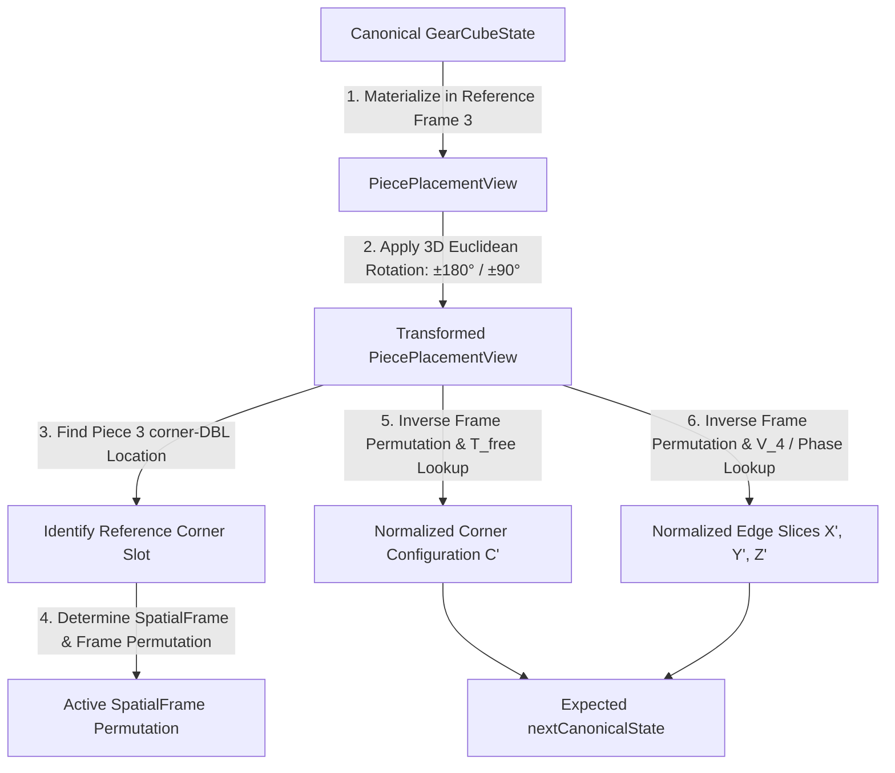
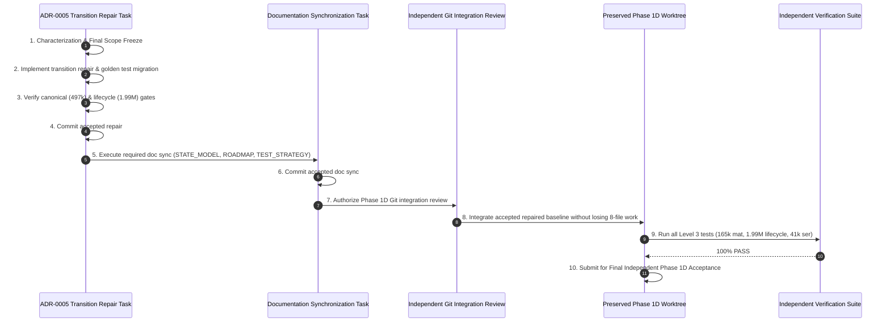

# ADR_0005_TRANSITION_REPAIR_PLAN.md — Cross-Phase Transition Repair Implementation Plan

> **Document Status:** `PENDING_REVIEW`
> **Authoritative ADR:** [`ADR-0005-CANONICAL-MOVE-TRANSITION-ALGEBRA.md`](../decisions/ADR-0005-CANONICAL-MOVE-TRANSITION-ALGEBRA.md) (`Adopt canonical move transition algebra` at commit `db3ad11baab5d4ba56de6b90e3228c9200bf62a4`)
> **Target Worktree:** Clean dedicated cross-phase repair worktree (e.g. `..\GearCube-Lab-adr0005-transition-repair`)
> **Baseline Commit:** `db3ad11baab5d4ba56de6b90e3228c9200bf62a4`
> **Applicability:** Pure TypeScript Domain Core (`packages/core`), Transition Tables (`transition-data.ts`), and Phase 1C Transition Unit Tests (`transitions.test.ts`)
> **Lifecycle:** `HISTORICAL IMPLEMENTATION PLAN / COMPLETED`
> **Current Authority:** The accepted transition decision, current state model, and [`ROADMAP.md`](ROADMAP.md) govern current behavior; this plan preserves the pre-acceptance repair sequence.

---

## 1. Purpose & Accepted ADR Authority

This implementation plan defines the exact, bounded engineering roadmap for executing the cross-phase canonical transition repair mandated by **Accepted ADR-0005**.

ADR-0005 established that:
1. `applyMove(state: GearCubeState, move: Move): GearCubeState` is the closed, reference-normalized canonical transition function on the $41,472$-element state space.
2. Existing Phase 1C transition tables in `packages/core/src/transition-data.ts` are exact for positive-axis faces ($U, F, R$), but fail to incorporate reference-frame rotation for negative-axis faces ($D, B, L$).
3. Corrected canonical transition data for $D, B, L$ must be derived via an independent reference oracle, verified across all $497,664$ canonical transitions and all $1,990,656$ application lifecycle transitions, and committed in a dedicated cross-phase repair task prior to resuming Phase 1D re-acceptance.

---

## 2. Starting Baseline

- **Authoritative Commit:** `db3ad11baab5d4ba56de6b90e3228c9200bf62a4` (`Adopt canonical move transition algebra`).
- **Branch:** `phase/adr0005-transition-repair-plan` (planning) $\to$ `phase/adr0005-transition-repair-implementation` (subsequent repair execution).
- **Preserved Implementation Worktree:** `c:\Users\LAB-606\Desktop\Software Side Project\GearCube-Lab-phase1d-implementation` remains strictly preserved and untouched.

---

## 3. Established Defect Characterization

Exhaustive empirical characterization established the following immutable evidence:

```text
               +-------------------------------------------------------------+
               |              PAIR TRANSITION CLOSURE PROOF                  |
               |                                                             |
               |  41,472 states x 4 SpatialFrames x 12 directed moves        |
               |  = 1,990,656 transitions                                    |
               |  - 1,990,656 / 1,990,656 normalizable                       |
               |  - 0 invalid or un-normalizable physical outcomes           |
               +------------------------------+------------------------------+
                                              |
                                              v
               +-------------------------------------------------------------+
               |        CANONICAL NEXT-STATE FRAME INDEPENDENCE              |
               |                                                             |
               |  41,472 states x 12 directed moves = 497,664 keys           |
               |  - 497,664 / 497,664 keys produce exactly 1 unique          |
               |    nextCanonicalState across all 4 initial SpatialFrames     |
               |  - 0 keys produce 2, 3, or 4 distinct next states           |
               +------------------------------+------------------------------+
                                              |
                                              v
               +-------------------------------------------------------------+
               |             SYSTEMATIC 50% DISCREPANCY PATTERN              |
               |                                                             |
               |  - U, F, R (Positive Faces): 100% correct across all 4      |
               |    frames, both directions, and all 41,472 states (995,328) |
               |  - D, B, L (Negative Faces): 100% mismatch across all 4     |
               |    frames, both directions, and all 41,472 states (995,328) |
               +-------------------------------------------------------------+
```

---

## 4. Frozen Architecture Invariants

The repair task must strictly adhere to the following frozen architectural boundaries:

1. **State-Only Canonical Transition:**
   $$\text{applyMove}: \text{GearCubeState} \times \text{Move} \to \text{GearCubeState}$$
   `SpatialFrame` is strictly excluded from `GearCubeState`, `applyMove` signatures, and solver algorithms.
2. **State Space Invariance:**
   $\text{GearCubeState}$ cardinality is exactly $|\mathcal{S}| = \mathbf{41,472}$ with fields `{ cornerConfiguration, sliceX, sliceY, sliceZ }`.
3. **Move Vocabulary Invariance:**
   Exactly 12 legal directed moves ($\text{Face} \in \{U, D, F, B, R, L\} \times \text{Direction} \in \{\text{CW}, \text{CCW}\}$).
4. **Presentation Lifecycle Invariance:**
   $$\text{nextView} = \text{materializeState}(\text{applyMove}(\text{state}, \text{move}), \text{nextSpatialFrame}(\text{frame}, \text{move.face}))$$
   `SpatialFrame` is solely used for fixed-spatial presentation and 3D rendering.

---

## 5. Independent Derivation Methodology

To guarantee zero circularity or test-fitting, replacement canonical transition tables will be computed using an independent normative reference pipeline:



### Prohibited Table Generation Practices:
- ❌ Manual trial-and-error editing of numbers in `transition-data.ts`.
- ❌ Incrementally tweaking table cells until unit tests turn green.
- ❌ Using corrected production code to generate its own expected test fixtures.
- ❌ Copying production tables into the reference oracle.

---

## 6. Exact Transition-Data Characterization Procedure

Before modifying production files, the implementation task will run a read-only Python derivation script to verify the exact table structures:

### 6.1. `CORNER_TRANSITIONS`
- **$D, B, L$:** Compute all $24$ entries for faces $D, B, L$ via independent physical simulation.
- **$U, F, R$:** Confirm that independently derived entries for $U, F, R$ match existing production data $100\%$ ($24 / 24$ rows).

### 6.2. `SLICE_K_TRANSITIONS`
- **$D, B, L$:** Compute all $2 \times 3 \times 24 \times 4$ permutations for directions $\{\text{CW}, \text{CCW}\}$, slices $\{X, Y, Z\}$, corner ranks $\{0 \dots 23\}$, and permutation classes $\{0 \dots 3\}$.
- **$U, F, R$:** Confirm that independently derived entries for $U, F, R$ match existing production data $100\%$.

### 6.3. `SLICE_DELTA_PHASES`
- Independently evaluate gear twist phase increments for all 12 directed moves.
- **Hypothesis:** All 12 entries are already correct (`UNCHANGED_AND_INDEPENDENTLY_VERIFIED`). Confirm this holds across all transitions.

### 6.4. `transitions.ts` Algorithm Check
- Verify that `applyMove` logic (array indexing and modulo phase addition) requires **zero algorithmic modifications** (`NO_ALGORITHM_CHANGE`).

---

## 7. Proposed Production Scope & Scope Review Boundaries

The hypothesized minimum production modification scope before characterization is:

```text
EXPECTED MODIFIED:
packages/core/src/transition-data.ts

EXPECTED PRESERVED UNCHANGED:
packages/core/src/transitions.ts
packages/core/src/values.ts
packages/core/src/constants.ts
packages/core/src/validation.ts
packages/core/src/index.ts
```

### 7.1. Scope Review vs. Architecture Review Escalation
If pre-edit characterization demonstrates that the implementation surface differs from the two-file hypothesis:

1. **`SCOPE_REVIEW_REQUIRED` (Data-Only Scope Expansion):**
   - Triggered if an additional data-bearing production file is required, `SLICE_DELTA_PHASES` requires a compatible data-only correction, or test fixture scope needs bounded expansion while all canonical ADR-0005 invariants remain 100% intact.
   - Action: STOP execution and request an independent scope review. Zero production edits are permitted until the expanded scope is reviewed and authorized.
2. **`ARCHITECTURE_REVIEW_REQUIRED` (Domain / Architectural Contradiction):**
   - Triggered if characterization indicates canonical `nextState` depends on `SpatialFrame`, `GearCubeState` structure or cardinality changes, Move vocabulary changes, solver requires `SpatialFrame`, $U, F, R$ semantics require correction, `transitions.ts` requires transition-engine algorithmic/structural redesign, or center orientation returns to endpoint state.
   - Action: STOP execution immediately for full architectural review.

---

## 8. Proposed Test Scope

```text
MODIFIED:
packages/core/tests/transitions.test.ts

NEW TEST SUITE (Cross-Phase Transition Acceptance):
packages/core/tests/canonical-transitions.test.ts (or added to transitions.test.ts)
```

The test scope encompasses:
1. Updating obsolete $D, B, L$ golden vectors in `transitions.test.ts` (Solved state and multi-move sequences).
2. Adding exhaustive verification of all $497,664$ canonical transitions against the independent oracle.
3. Adding full non-regression verification of all $248,832$ positive-face transitions ($U, F, R$).

---

## 9. Positive-Face Non-Regression Strategy ($U, F, R$)

- **Target Moves:** $U_{\text{CW}}, U_{\text{CCW}}, F_{\text{CW}}, F_{\text{CCW}}, R_{\text{CW}}, R_{\text{CCW}}$ ($6$ moves).
- **Scope:** All $41,472$ states $\times 6$ moves $= \mathbf{248,832}$ transitions.
- **Pass Condition:** Exactly $248,832 / 248,832$ transitions produce output identical to the baseline Phase 1C implementation ($0$ regressions).

---

## 10. Negative-Face Correction Strategy ($D, B, L$)

- **Target Moves:** $D_{\text{CW}}, D_{\text{CCW}}, B_{\text{CW}}, B_{\text{CCW}}, L_{\text{CW}}, L_{\text{CCW}}$ ($6$ moves).
- **Scope:** All $41,472$ states $\times 6$ moves $= \mathbf{248,832}$ transitions.
- **Pass Condition:** Exactly $248,832 / 248,832$ transitions match the independent reference oracle ($0$ mismatches).

---

## 11. Canonical Exhaustive Acceptance Gate

| Metric | Target Value | Pass Threshold |
| :--- | :--- | :--- |
| **Total Canonical Transitions** | $41,472 \times 12 = \mathbf{497,664}$ | $497,664 / 497,664$ ($100.0\%$) |
| **Oracle Equivalence** | $\text{applyMove}(s, m) \equiv \text{oracleNextState}(s, m)$ | $\mathbf{0}$ mismatches |
| **State Validity** | `isGearCubeState(nextState) === true` | $\mathbf{0}$ invalid |

---

## 12. Full Application Lifecycle Exhaustive Gate

| Metric | Target Value | Pass Threshold |
| :--- | :--- | :--- |
| **Total Lifecycle Transitions** | $41,472 \times 4 \times 12 = \mathbf{1,990,656}$ | $1,990,656 / 1,990,656$ ($100.0\%$) |
| **Physical Equivalence** | $\text{materialize}(\text{applyMove}(s, m), \text{nextSpatialFrame}(f, m.\text{face})) \equiv \text{simPhysical}(\text{materialize}(s, f), m)$ | $\mathbf{0}$ mismatches |
| **Frame Correctness** | $\text{nextSpatialFrame}(f, m.\text{face}) \equiv \text{simFrame}(f, m.\text{face})$ | $\mathbf{0}$ mismatches |

---

## 13. Phase 1C Regression Migration

1. **Audit Existing Golden Tests:**
   In `packages/core/tests/transitions.test.ts`, the Solved-state 12 golden vectors currently assert un-normalized $D, B, L$ values (e.g. `D CW -> C=1, X=(0,0), Y=(1,2), Z=(0,0)`).
2. **Harmonized Golden Vectors (Solved State):**
   - $U_{\text{CW}}$: $C=6, X=(1,0), Y=(3,1), Z=(1,0)$ (Unchanged)
   - $U_{\text{CCW}}$: $C=6, X=(1,0), Y=(1,2), Z=(1,0)$ (Unchanged)
   - $D_{\text{CW}}$: $C=6, X=(1,0), Y=(3,2), Z=(1,0)$ (Corrected)
   - $D_{\text{CCW}}$: $C=6, X=(1,0), Y=(1,1), Z=(1,0)$ (Corrected)
   - $F_{\text{CW}}$: $C=14, X=(1,0), Y=(1,0), Z=(3,1)$ (Unchanged)
   - $F_{\text{CCW}}$: $C=14, X=(1,0), Y=(1,0), Z=(1,2)$ (Unchanged)
   - $B_{\text{CW}}$: $C=14, X=(1,0), Y=(1,0), Z=(3,2)$ (Corrected)
   - $B_{\text{CCW}}$: $C=14, X=(1,0), Y=(1,0), Z=(1,1)$ (Corrected)
   - $R_{\text{CW}}$: $C=21, X=(3,1), Y=(1,0), Z=(1,0)$ (Unchanged)
   - $R_{\text{CCW}}$: $C=21, X=(1,2), Y=(1,0), Z=(1,0)$ (Unchanged)
   - $L_{\text{CW}}$: $C=21, X=(3,2), Y=(1,0), Z=(1,0)$ (Corrected)
   - $L_{\text{CCW}}$: $C=21, X=(1,1), Y=(1,0), Z=(1,0)$ (Corrected)
3. **Property Invariants:**
   - 4-cycle identity $(M_{\text{CW}})^4 = I$: Preserved across all 6 faces.
   - Inverse cancellation $M_{\text{CW}} \circ M_{\text{CCW}} = I$: Preserved across all 6 faces.

---

## 14. Preserved Phase 1D Worktree & Re-Entry Governance



### 14.1. Strict Linear Recovery Sequence
1. The dirty worktree `c:\Users\LAB-606\Desktop\Software Side Project\GearCube-Lab-phase1d-implementation` remains strictly preserved and untouched during repair.
2. The production repair commit alone does **NOT** constitute full architectural recovery.
3. Phase 1D integration and final acceptance must **NOT** proceed against a stale documentation baseline. Required documentation synchronization must complete and be accepted before Phase 1D integration.
4. Git integration is **NOT** authorized by this repair planning task; the integration strategy (rebase/cherry-pick/etc.) is a later separately reviewed operational step.
5. Only after successful integration and 100% pass across all Phase 1D re-acceptance gates may Phase 1D be submitted for final independent acceptance. Downstream Phase 1E progression remains strictly blocked until Phase 1D acceptance is complete.

---

## 15. Mandatory Phase 1D Re-Acceptance Gates

Prior to final Phase 1D acceptance, the following gates must be rerun:

| Gate | Target Domain | Pass Condition |
| :--- | :--- | :--- |
| **Model A Center Raw Keys** | $1,536$ coordinate combinations | $1,536 / 1,536$ ($0$ mismatches) |
| **Center Identity Oracle** | $41,472$ canonical states | $41,472 / 41,472$ ($0$ mismatches) |
| **Center Move Goldens** | Solved + 12 directed moves | $13 / 13$ passing |
| **Materialization Oracle** | $165,888$ state-frame pairs | $165,888 / 165,888$ ($0$ mismatches) |
| **Normalization Round-Trip** | $165,888$ state-frame pairs | $165,888 / 165,888$ ($0$ mismatches) |
| **Application Lifecycle** | $1,990,656$ transitions | $1,990,656 / 1,990,656$ ($0$ mismatches) |
| **Serialization Round-Trip** | $41,472$ canonical states | $41,472 / 41,472$ ($0$ errors) |
| **Serialization Uniqueness** | $41,472$ canonical states | Exactly $41,472$ distinct strings |
| **Full Repository Verify** | `npm run verify` | $100\%$ green |

---

## 16. Documentation Synchronization Sequencing

To maintain strict contract-first governance while preventing scope contamination:

1. **Step 1 (This Repair Task):**
   - Execute production repair (`transition-data.ts`) and test migration (`transitions.test.ts`).
   - Satisfy all canonical transition gates ($497,664 / 497,664$).
2. **Step 2 (Documentation Synchronization Task / Commit):**
   - `docs/architecture/GEAR_CUBE_STATE_MODEL.md`: Update Section 8 to document reference-normalized move semantics (`UPDATE_REQUIRED`).
   - `docs/development/ROADMAP.md`: Record completion of ADR-0005 repair milestone (`UPDATE_REQUIRED`).
   - `docs/development/TEST_STRATEGY.md`: Record Level 2 / Level 3 transition gates (`UPDATE_REQUIRED`).
   - `docs/architecture/PUZZLE_CONTRACTS.md`: `AUDIT_ONLY`.
   - `docs/architecture/KINEMATIC_CONTRACT.md`: `AUDIT_ONLY`.
   - `docs/README.md`: `AUDIT_ONLY`.

---

## 17. Public API & Compatibility Impact

- **Public Types & Signatures:** **COMPATIBLE** (Zero changes).
- **Public Export Count:** **COMPATIBLE** (53 public exports preserved).
- **State Representation:** **COMPATIBLE** (Cardinality $41,472$ preserved).
- **Move Vocabulary:** **COMPATIBLE** (12 legal moves preserved).
- **Observable Behavior:** **CORRECTNESS_FIX_WITH_BEHAVIOR_CHANGE**
  - Outputs for $D, B, L$ moves intentionally change from the incorrect Phase 1C un-normalized values to reference-normalized canonical values.
  - Callers relying on the prior incorrect $D, B, L$ transitions are behaviorally incompatible.

---

## 18. Stop Conditions

Execution must immediately STOP and report under the following exact classifications:

### 18.1. `SCOPE_REVIEW_REQUIRED`
1. Independent characterization reveals that `SLICE_DELTA_PHASES` requires a data-only correction that is semantically compatible with ADR-0005.
2. Independent characterization reveals that an additional data-bearing production or test file is required.
3. Concrete representation changes are required without changing canonical state transitions.

### 18.2. `ARCHITECTURE_REVIEW_REQUIRED`
1. Independently derived canonical nextState exhibits dependency on `SpatialFrame`.
2. `GearCubeState` structure or cardinality ($41,472$) must change.
3. Public Move vocabulary must change.
4. Solver requires `SpatialFrame`.
5. Positive faces ($U, F, R$) exhibit semantic regressions.
6. `packages/core/src/transitions.ts` requires algorithmic structural modification.
7. `SLICE_DELTA_PHASES` requires semantic alteration inconsistent with ADR-0005.
8. Implementation cannot be derived from the independent reference oracle.
9. Historical planning artifacts (`PHASE_1C_IMPLEMENTATION_PLAN.md`, `PHASE_1D_IMPLEMENTATION_PLAN.md`) are altered.
10. Center orientation is forced back into endpoint state.

---

## 19. Acceptance Criteria & Future Task / Commit Boundaries

### 19.1. Acceptance Criteria
- [x] Independent mathematical derivation of corrected $D, B, L$ transition data.
- [x] Zero regressions on all $248,832$ positive-face transitions ($U, F, R$).
- [x] $100\%$ pass on all $248,832$ negative-face transitions ($D, B, L$) against the reference oracle.
- [x] $100\%$ pass on all $497,664$ canonical transitions.
- [x] $100\%$ pass on all $1,990,656$ application lifecycle transitions.
- [x] Updated unit test golden fixtures in `transitions.test.ts`.
- [x] Zero modification to preserved Phase 1D implementation worktree during repair.

### 19.2. Future Task & Commit Boundaries
The recovery roadmap establishes explicit, dependency-ordered responsibility boundaries:
- **Task A (Planning):** Author and independently accept `ADR_0005_TRANSITION_REPAIR_PLAN.md` (Commit 1).
- **Task B (Characterization & Scope Freeze):** Run read-only derivation script, verify table structures, and freeze final repair scope:
  - *If characterization confirms* that `CORNER_TRANSITIONS` D/B/L require repair, `SLICE_K_TRANSITIONS` D/B/L require repair, `SLICE_DELTA_PHASES` require no repair, `transitions.ts` requires no algorithm change, and no other file is required, *then freeze final repair scope to exactly* `packages/core/src/transition-data.ts` and `packages/core/tests/transitions.test.ts`.
  - *If characterization produces a different compatible scope*, trigger `SCOPE_REVIEW_REQUIRED` before making any production edit.
- **Task C (Production & Test Repair):** Apply verified data corrections to frozen scope and execute canonical acceptance gates.
- **Task D (Repair Commit):** Stage and commit exactly the frozen repair files with subject `Harmonize canonical move transition data` (Commit 2).
- **Task E (Documentation Synchronization):** Update `GEAR_CUBE_STATE_MODEL.md`, `ROADMAP.md`, `TEST_STRATEGY.md`, audit other contracts, and commit `Synchronize architecture contracts with ADR-0005` (Commit 3).
- **Task F (Phase 1D Integration & Re-Acceptance):** Under a separately reviewed integration plan, integrate the repaired baseline into the Phase 1D worktree, execute all Level 3 acceptance gates, and complete Phase 1D final independent acceptance.

---

## 20. Explicit Non-Goals

- ❌ **No Premature Phase 1E (Solver / BFS):** Breadth-first search and solver pattern databases remain strictly blocked until Phase 1D re-acceptance is complete.
- ❌ **No Modification of Preserved Phase 1D Worktree:** The uncommitted Phase 1D implementation worktree is NOT touched in this task.
- ❌ **No Modification of ADR-0004 or ADR-0005 Decisions:** ADR documents remain frozen.
- ❌ **No Retroactive Historical Plan Edits:** `PHASE_1C_IMPLEMENTATION_PLAN.md` remains preserved as an immutable historical artifact.
