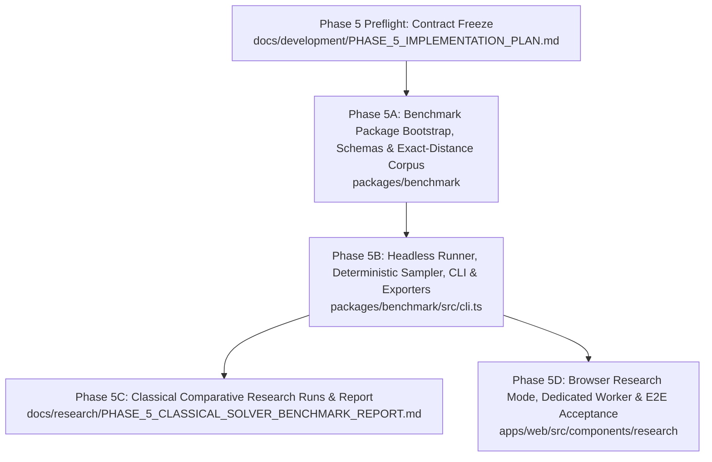

# PHASE_5_IMPLEMENTATION_PLAN.md — Research & Benchmarking Harness

> **Document Status:** `PHASE5_ACCEPTED`
> **Authoritative Main Baseline:** `717f2b89a425b2da6437e75adf4c4245aee8dc08`
> **Accepted Technical Head:** `8bc1d51d74e3b047872598f3439755361cd91fb6`
> **Implementation Branch:** `phase/5d-research-mode-implementation`
> **Implementation Started:** `YES`
> **Phase 5 Accepted:** `YES`
> **Phase 5 Preflight Accepted:** `YES`
> **Phase 5A Status:** `COMPLETED & ACCEPTED`
> **Phase 5B Status:** `COMPLETED & ACCEPTED`
> **Phase 5C Status:** `COMPLETED & ACCEPTED`
> **Phase 5D Status:** `COMPLETED & ACCEPTED`
> **Lifecycle:** `HISTORICAL MILESTONE ACCEPTANCE RECORD`
> **Current Test Inventory:** 36 Vitest files / 452 tests (the acceptance counts below are as-of the accepted technical head).

---

## Acceptance Record

### Phase 5 Preflight Acceptance
- **INITIAL_PREFLIGHT_CANDIDATE:** `b7c99c9170eb3e49396a28b10cf30cb58a97fde2`
- **PREFLIGHT_REPAIR:** `762849e34c691982986813f4d3fd318b73a4fa42`
- **INDEPENDENT_REVIEW:** `PASS`
- **PHASE5_PREFLIGHT_STATUS:** `COMPLETED & ACCEPTED`

### Phase 5A Implementation Acceptance
- **PHASE5A_IMPLEMENTATION:** `e31f0f0ab1b42f71301b90f09b9b53bc6ca2f64e`
- **PHASE5A_INDEPENDENT_REVIEW:** `PASS`
- **PHASE5A_EXACT_HEAD_REVALIDATION:** `PASS`
- **PHASE5A_ACCEPTED:** `YES`

### Phase 5B Implementation Acceptance
- **PHASE5B_INITIAL_IMPLEMENTATION:** `c53344c9a1ae4f18ee6a6c3b6b56748efaa8e7b7`
- **PHASE5B_REPAIR_1:** `68cd6e96a5bb5c0e29be6c4d00f002d5bcf005d8`
- **PHASE5B_ACCEPTED_TECHNICAL_HEAD:** `d3989cde79087811506ed0295d8411739301db92`
- **PHASE5B_INDEPENDENT_REVIEW:** `PASS`
- **PHASE5B_ACCEPTED:** `YES`

### Phase 5D Browser Research Mode Implementation Acceptance
- **PHASE5D_ACCEPTED_TECHNICAL_HEAD:** `8bc1d51d74e3b047872598f3439755361cd91fb6`
- **AUTOMATED_RESEARCH_E2E:** `12 / 12 PASS`
- **FULL_PLAYWRIGHT_E2E:** `40 / 40 PASS`
- **BOUNDARY_ISOLATION_SUITE:** `52 / 52 PASS`
- **CONTROLLER_UNIT_SUITE:** `32 / 32 PASS`
- **FULL_WORKSPACE_VERIFY:** `PASS` (35 / 35 test files, 444 tests)
- **GATE4_REPEAT_CANCELLATION:** `2 / 2 PASS` (zero replacement workers)
- **INTERACTIVE_DEVTOOLS_ACCEPTANCE:** `PASS` (desktop, tablet, mobile viewports; zero console errors)
- **RAW_WEBGL_ORACLE:** `PASS` (exact decoded RGBA bitmap equality)
- **INDEPENDENT_TECHNICAL_REVIEW:** `PASS`
- **PHASE5D_TECHNICAL_STATUS:** `COMPLETED & ACCEPTED`
- **PHASE5_FORMAL_STATUS:** `COMPLETED & ACCEPTED`

### Phase 5C Research & Benchmark Report Acceptance
- **PHASE5C_EXECUTION_BASELINE_COMMIT:** `1fcc48dffcc10a59dbb9fe1eb1e5d7e2ce123ba6`
- **PHASE5C_RESEARCH_EVIDENCE_COMMIT:** `4cf4efb47841c7d0fa206991734736a751ac1fd2`
- **PHASE5C_REPORT_TECHNICAL_HEAD:** `7552e61ffd79766b66d34ace0e510776aa8b9cb6`
- **TOTAL_STORED_MEASURED_ROWS:** `3546`
- **TOTAL_SOLVER_INVOCATIONS:** `4698`
- **ALL_SOLVED:** `3546 / 3546`
- **LIMIT_REACHED:** `0`
- **OPTIMALITY_VIOLATIONS:** `0`
- **TIMING_DETERMINISTIC_PROJECTION_MISMATCHES:** `0`
- **ALL_TEN_PHASE5C_GATES:** `PASS`
- **INDEPENDENT_REVIEW:** `PASS`
- **PHASE5C_ACCEPTED:** `YES`
- **PHASE5D_STATUS:** `COMPLETED & ACCEPTED`
- **REPORT_REFERENCE:** [`docs/research/PHASE_5_CLASSICAL_SOLVER_BENCHMARK_REPORT.md`](../research/PHASE_5_CLASSICAL_SOLVER_BENCHMARK_REPORT.md)

---

## 1. Executive Summary & Purpose

Phase 5 establishes a rigorous, reproducible, and deterministic empirical research and benchmarking harness for the GearCube Lab framework. This system enables comparative evaluation of graph search algorithms (uninformed BFS, bidirectional BFS, IDA* with pattern database heuristics, and future learned heuristics) across exact-distance-stratified benchmark suites.

This preflight implementation plan freezes all architectural boundaries, type contracts, sampling methodologies, export schemas, execution layers, and subphase acceptance criteria **before** any benchmark implementation begins.

---

## 2. Governance & Policy Context

- **Applicability:** Pure TypeScript benchmark engine, Node CLI adapter, and browser Research Mode web worker architecture.
- **Puzzle Truth Axiom:** `@gearcube/core` remains the sole, immutable source of puzzle truth. The benchmark subsystem never owns or defines puzzle mechanics.
- **Solver Contract Decoupling:** Benchmarks evaluate algorithms exposed through `@gearcube/solvers` using canonical contracts (`solveBfs`, `solveBidirectionalBfs`, `solveIdaStar`).
- **Isolation Axiom:** Heavy benchmark search runs never execute synchronously on the browser UI main thread.

---

## 3. Resolution of Phase 5 Preflight Decisions (Questions A–N)

| Decision ID | Topic | Preflight Resolution & Contract Freeze |
| :--- | :--- | :--- |
| **A** | Package Boundary | `@gearcube/benchmark` depends directly on `@gearcube/core` and `@gearcube/solvers`. Zero 3rd-party runtime dependencies. Pure TypeScript. Root entry is browser-safe. |
| **B** | Corpus Ownership | `packages/benchmark` owns benchmark corpus and case generation, building an independent exact-distance index via `@gearcube/core` without importing solver tests or private codec internals. |
| **C** | Suite / Case Schema | Versioned `BenchmarkSuiteConfig` (`schemaVersion: "1"`), `BenchmarkCase` with state-derived stable ID (`d<depth>:<stateKey>`), `BenchmarkTrialResult` discriminated union (measured trials only), `BenchmarkSummary`, and `BenchmarkReport`. |
| **D** | Seed Semantics | Seed is a `string` (empty string valid, no normalization/trimming), hashed via `FNV1A_UTF16_CODE_UNITS_32` into a 32-bit unsigned integer feeding `MULBERRY32_EXACT`. |
| **E** | Sampling Policy | Stratified sampling by exact canonical distance ($d \in [1 \dots 8]$), selecting $K$ unique cases per depth without replacement via partial Fisher-Yates on ordinally sorted state keys. Depth 0 is a corpus control state, not a sampled benchmark case in v1. |
| **F** | Metric Schema | Formal separation of deterministic search metrics (`nodesExpanded`, `nodesGenerated`, `solutionDepth`, `solutionMoves`, `status`, `limitReason`) from observational performance metrics (`elapsedMs`, timestamps, environment provenance). |
| **G** | Metric Determinism | Deterministic fields must match bit-for-bit across identical runs. Observational fields are excluded from bit-for-bit equality gates. |
| **H** | Timing Treatment | `elapsedMs` is recorded unrounded as an observational research metric. No absolute wall-clock timing gates in preflight or cross-machine CI. |
| **I** | Memory Methodology | Memory measurement is `OPTIONAL / OBSERVATIONAL`. Not frozen in schemaVersion `"1"` core trial schema. Absence is never a deterministic failure. |
| **J** | Warm-Up / Repetition | `warmupRuns >= 0` (executed before measured trials, discarded, not in report/CSV/summary) and `measuredRuns >= 1` (recorded as individual measured trials with indices `0 .. measuredRuns - 1`). |
| **K** | Resource Limits | Supported limits match solver options: `maxNodes` (integer $\ge 1$) and `maxDepth` (integer $\ge 0$). No artificial timeout or heuristic weight contracts. |
| **L** | Export Formats | Lossless, versioned JSON export and flat, per-trial 14-column CSV export with RFC-4180 escaping and space-separated move token encoding (`<FACE>_<DIRECTION>`). |
| **M** | Execution Boundaries | Three strictly isolated layers: (1) Browser-safe Benchmark Engine (`packages/benchmark`), (2) Node CLI Adapter (`packages/benchmark/src/cli.ts`), and (3) Browser Research Mode (`apps/web` via dedicated Web Worker). |
| **N** | Reference Environment | System/hardware metadata captured as non-normative provenance. Proposed targets (60 FPS, sub-1ms) remain non-binding performance goals until reference profiles are established. |

---

## 4. System Architecture & Component Topology

```
+---------------------------------------------------------------------------------------------------+
|                                     GEARCUBE LAB ECOSYSTEM                                        |
|                                                                                                   |
|  [ apps/web ] (Presentation Layer)                                                                |
|    ├── Play Mode UI (Implemented - Phase 3)                                                       |
|    ├── Solve Mode UI & Solver Worker (Implemented - Phase 4)                                      |
|    └── Research Mode UI & Dedicated Benchmark Worker (Phase 5D)                                   |
|              │                                                                                    |
|              ▼ (Dispatches Benchmark Jobs off UI Thread)                                          |
|  [ Dedicated Browser Worker Adapter ] (apps/web/src/workers/benchmark.worker.ts)                   |
|              │                                                                                    |
|              ▼ (Imports Browser-Safe Benchmark Engine)                                            |
|  [ Pure Benchmark Engine ] (@gearcube/benchmark — packages/benchmark)                             |
|    ├── Corpus Builder (Core-only exhaustive exact-distance traversal: 41,472 states, diameter 8) |
|    ├── Deterministic Stratified Sampler (FNV1A_UTF16_CODE_UNITS_32 + Mulberry32)                  |
|    ├── Benchmark Runner & Metric Aggregator                                                       |
|    └── JSON / CSV Exporters (Browser-safe & Node-safe)                                            |
|         │                                │                                                        |
|         │ (Orchestrates Search)          │ (Validates States & Exact Traversal)                   |
|         ▼                                ▼                                                        |
|  [ Pure Solver Engine ]          [ Discrete Domain Core ]                                         |
|  (@gearcube/solvers)             (@gearcube/core)                                                 |
|    ├── BFS Solver                      ├── Canonical State Types (`GearCubeState`)                |
|    ├── Bidirectional BFS               ├── Transition Functions (`applyMove`)                     |
|    └── IDA* (H2 PDB Heuristic)         └── Canonical Codecs (`serializeLogicalState`)             |
|                                                                                                   |
|  [ Node CLI Adapter ] (packages/benchmark/src/cli.ts)                                            |
|    └── Headless terminal runner executing @gearcube/benchmark with filesystem export (node:fs)   |
+---------------------------------------------------------------------------------------------------+
```

### 4.1. Dependency & Import Axioms
1. `packages/benchmark` $\longrightarrow$ `@gearcube/core`
2. `packages/benchmark` $\longrightarrow$ `@gearcube/solvers`
3. `apps/web` $\longrightarrow$ `@gearcube/benchmark` (imports browser-safe engine and type contracts only).
4. `apps/web` **must not** import the Node CLI adapter (`cli.ts`).
5. Root/public entry of `packages/benchmark` **must not** import `node:fs`, `node:path`, or process-dependent CLI code.
6. `packages/benchmark` has **zero** runtime dependencies on `apps/web`, React, Three.js, DOM, or Worker global objects in its core engine entry.

---

## 5. Benchmark Contracts & Data Schemas

### 5.1. Configuration Schema (`BenchmarkSuiteConfig`)

```typescript
export interface BenchmarkSuiteConfig {
  readonly schemaVersion: '1';
  readonly suiteId: string;
  readonly seed: string;
  readonly exactDepths: readonly number[]; // e.g. [1, 2, 3, 4, 5, 6, 7, 8]
  readonly casesPerDepth: number;          // integer >= 1
  readonly algorithms: readonly ('BFS' | 'BIDIRECTIONAL_BFS' | 'IDA_STAR')[];
  readonly warmupRuns: number;             // integer >= 0, default: 0
  readonly measuredRuns: number;           // integer >= 1, default: 1
  readonly limits?: {
    readonly maxNodes?: number;            // integer >= 1
    readonly maxDepth?: number;            // integer >= 0
  };
}
```

#### Pre-Execution Validation Rules:
- `schemaVersion`: Must be exactly `'1'`.
- `suiteId`: Non-empty string.
- `seed`: String (empty string `""` is valid).
- `exactDepths`: Non-empty array of unique, strictly increasing integers with each depth in $1 \dots 8$. (Depth 0 is not a sampled benchmark case in v1).
- `casesPerDepth`: Integer $\ge 1$, must not exceed candidate count in any requested depth bucket.
- `algorithms`: Non-empty array of unique supported algorithms (`'BFS' | 'BIDIRECTIONAL_BFS' | 'IDA_STAR'`). Configuration order is preserved as base algorithm ordering.
- `warmupRuns`: Integer $\ge 0$.
- `measuredRuns`: Integer $\ge 1$.
- `limits.maxNodes`: If present, integer $\ge 1$.
- `limits.maxDepth`: If present, integer $\ge 0$.
- **Policy:** Any invalid configuration throws a validation error and aborts before running any solver trials.

### 5.2. Benchmark Case Schema (`BenchmarkCase`)

```typescript
export interface BenchmarkCase {
  readonly caseId: string;       // State-derived stable identifier: `d${exactDepth}:${stateKey}`
  readonly stateKey: string;     // Canonical serializeLogicalState string
  readonly exactDepth: number;   // True mathematical distance from solved state (1..8)
}
```

- **Case ID Stability Guarantee:** `caseId` is strictly `d${exactDepth}:${stateKey}`. It is derived entirely from the canonical state and mathematical depth, independent of suite ID, random seed, or sample index position.

### 5.3. Trial Result Schema (`BenchmarkTrialResult`)

`BenchmarkTrialResult` represents **measured solver executions only** as a discriminated union aligned directly with `@gearcube/solvers` contracts:

```typescript
export interface BenchmarkTrialBase {
  readonly caseId: string;
  readonly exactDepth: number;
  readonly algorithm: 'BFS' | 'BIDIRECTIONAL_BFS' | 'IDA_STAR';
  readonly repetitionIndex: number; // 0-indexed measured run: 0 .. measuredRuns - 1
  readonly nodesExpanded: number;
  readonly nodesGenerated: number;
  readonly elapsedMs: number;       // Unrounded observational timing from solver
}

export interface BenchmarkSolvedTrial extends BenchmarkTrialBase {
  readonly status: 'SOLVED';
  readonly solutionDepth: number;
  readonly solutionMoves: readonly Move[];
}

export interface BenchmarkLimitTrial extends BenchmarkTrialBase {
  readonly status: 'LIMIT_REACHED';
  readonly limitReason: 'MAX_NODES' | 'MAX_DEPTH';
}

export type BenchmarkTrialResult = BenchmarkSolvedTrial | BenchmarkLimitTrial;
```

- **Execution Failure vs. Empirical Trial:** Unexpected execution exceptions abort suite execution with non-zero exit rather than being recorded as empirical `ERROR` trials.
- **Warm-Up Policy:** Warm-up executions are performed prior to measured trials and discarded. They are never included in `BenchmarkReport.trials`, CSV exports, or summary statistics.

### 5.4. Summary & Aggregate Schema (`BenchmarkSummary`)

```typescript
export interface AlgorithmSummaryByDepth {
  readonly exactDepth: number;
  readonly totalTrials: number;
  readonly solvedCount: number;
  readonly limitCount: number;
  readonly meanNodesExpanded: number;
  readonly medianNodesExpanded: number;
  readonly meanNodesGenerated: number;
  readonly medianNodesGenerated: number;
  readonly meanElapsedMs: number;
  readonly medianElapsedMs: number;
}

export interface AlgorithmSummary {
  readonly algorithm: 'BFS' | 'BIDIRECTIONAL_BFS' | 'IDA_STAR';
  readonly byDepth: readonly AlgorithmSummaryByDepth[];
  readonly totalSolved: number;
  readonly totalLimits: number;
  readonly overallMeanNodesExpanded: number;
  readonly overallMedianElapsedMs: number;
}

export interface BenchmarkSummary {
  readonly totalCases: number;
  readonly totalTrials: number;
  readonly algorithms: readonly AlgorithmSummary[];
}
```

- **Precision & Calculation Definitions:**
  - Arithmetic mean: $\frac{\sum x_i}{N}$.
  - Median: Middle value for odd $N$; arithmetic mean of the two middle values for even $N$ on sorted arrays.
  - Summaries are computed from measured trials only.
  - Raw counters and summaries are stored unrounded in exported canonical reports.

### 5.5. Full Report Schema (`BenchmarkReport`)

```typescript
export interface EnvironmentProvenance {
  readonly platform: 'node' | 'browser';
  readonly executionTimestamp: string; // ISO 8601 string
  readonly os?: string;
  readonly architecture?: string;
  readonly nodeVersion?: string;
  readonly browserName?: string;
  readonly browserVersion?: string;
  readonly userAgent?: string;
  readonly cpuModel?: string;
  readonly logicalCores?: number;
  readonly repositoryCommit?: string;
}

export interface BenchmarkReport {
  readonly schemaVersion: '1';
  readonly config: BenchmarkSuiteConfig;
  readonly environment: EnvironmentProvenance;
  readonly cases: readonly BenchmarkCase[];
  readonly trials: readonly BenchmarkTrialResult[];
  readonly summary: BenchmarkSummary;
}
```

---

## 6. Deterministic Corpus, Hashing, PRNG & Sampling

### 6.1. Independent Core-Only Exact-Distance Corpus Builder
`packages/benchmark` builds an independent BFS distance index directly from `SOLVED_GEAR_CUBE_STATE` using `@gearcube/core`:
- Explores transitions exclusively via `applyMove` with `ALL_MOVES`.
- Tracks canonical state keys via `serializeLogicalState`.
- Discovers exactly **41,472** canonical states with maximum diameter **8**.
- Verifies exact canonical distance histogram:
  - Depth 0: 1
  - Depth 1: 12
  - Depth 2: 111
  - Depth 3: 822
  - Depth 4: 3,863
  - Depth 5: 11,706
  - Depth 6: 16,410
  - Depth 7: 8,196
  - Depth 8: 351
  - **Total:** 41,472
- Traversal runs outside measured solver executions and does not call production solver implementations.

### 6.2. Exact Seed Hash (`FNV1A_UTF16_CODE_UNITS_32`)
The seed string is hashed into an unsigned 32-bit integer without Unicode normalization or trimming:

```typescript
export function hashSeed(seed: string): number {
  let hash = 0x811c9dc5;
  for (let i = 0; i < seed.length; i++) {
    hash ^= seed.charCodeAt(i);
    hash = Math.imul(hash, 0x01000193);
  }
  return hash >>> 0;
}
```

### 6.3. Exact PRNG (`MULBERRY32_EXACT`)
State transition and 32-bit floating point generation $[0, 1)$:

```typescript
export function createMulberry32(seed32: number): () => number {
  let state = seed32 >>> 0;
  return function next(): number {
    state = (state + 0x6d2b79f5) >>> 0;
    let t = state;
    t = Math.imul(t ^ (t >>> 15), t | 1);
    t ^= t + Math.imul(t ^ (t >>> 7), t | 61);
    return ((t ^ (t >>> 14)) >>> 0) / 4294967296;
  };
}
```

### 6.4. Exact Sampling Algorithm (Partial Fisher-Yates)
For each depth $d \in \text{exactDepths}$ (processed in strictly increasing order):
1. Retrieve candidate state keys in distance bucket $d$.
2. Sort candidate state keys in **ordinal ECMAScript string order** (`a < b ? -1 : a > b ? 1 : 0`), never using `localeCompare`.
3. Work on a shallow copy of the sorted candidate array.
4. Execute partial Fisher-Yates shuffle for $i = 0 \dots K-1$:
   - $j = i + \lfloor \text{nextRandom}() \times (N - i) \rfloor$
   - $\text{swap}(\text{work}[i], \text{work}[j])$
   - $\text{selected}[i] = \text{work}[i]$
5. Exactly $K$ PRNG draws per depth using one continuous PRNG stream across depths.
6. Construct `BenchmarkCase` with `caseId = "d" + d + ":" + selected[i]`.

---

## 7. Trial Scheduling & Fairness

### 7.1. Execution Order
Cases are evaluated in canonical order (`exactDepth` ascending, then sampling order within depth).
For each case:
1. **Warm-Up Stage:** If `warmupRuns > 0`, execute each algorithm in configured order `warmupRuns` times. Results are discarded.
2. **Measured Stage:** For `repetitionIndex = 0 .. measuredRuns - 1`:
   - Execute configured algorithms in deterministic cyclic rotation:
     $$\text{rotationOffset} = (\text{caseOrdinal} + \text{repetitionIndex}) \pmod{|\text{algorithms}|}$$
   - Rotated algorithm index $k$: `(rotationOffset + k) % algorithms.length`.
   - Results recorded in `BenchmarkReport.trials` in actual execution sequence.

---

## 8. JSON & CSV Export Specifications

### 8.1. Lossless JSON Export
- Serializes complete `BenchmarkReport` with 2-space indentation.
- Contains measured trials only.
- Canonical JSON semantic round-trip required.

### 8.2. Flat Per-Trial CSV Export
- UTF-8 text with LF line endings.
- RFC-4180 compliant escaping (fields with comma, double quote, CR, or LF are enclosed in double quotes; embedded quotes doubled).
- **Exact 14-Column Header:**
  ```text
  schemaVersion,suiteId,seed,caseId,exactDepth,algorithm,repetitionIndex,status,solutionDepth,solutionMoves,nodesExpanded,nodesGenerated,limitReason,elapsedMs
  ```
- **Move Encoding in CSV:**
  - Solved: Space-delimited token string using `<FACE>_<DIRECTION>` (e.g. `"F_CW R_CCW U_CW"`). Valid tokens: `U_CW`, `U_CCW`, `D_CW`, `D_CCW`, `F_CW`, `F_CCW`, `B_CW`, `B_CCW`, `L_CW`, `L_CCW`, `R_CW`, `R_CCW`.
  - Limit Reached: Empty string `""` for `solutionDepth` and `solutionMoves`.
  - Solved: Empty string `""` for `limitReason`.

---

## 9. Subphase Decomposition & Execution Plan



### 9.1. Phase 5A: Package Bootstrap, Schemas & Exact-Distance Corpus
- **Deliverables:** `packages/benchmark/package.json`, `src/types.ts`, `src/corpus.ts`, `tests/corpus.test.ts`.
- **Acceptance Gates:**
  - `BENCHMARK_PACKAGE_BOUNDARY_GATE`: Dependencies strictly limited to `@gearcube/core` and `@gearcube/solvers`.
  - `CORE_TRUTH_GATE`: No local puzzle transition logic in benchmark package.
  - `EXACT_DISTANCE_CORPUS_CLOSURE_GATE`: Discovers exactly 41,472 reachable states.
  - `EXACT_DISTANCE_DIAMETER_GATE`: Maximum exact distance verified as 8.
  - `EXACT_DISTANCE_HISTOGRAM_GATE`: Matches exact canonical 0..8 distance histogram.
  - `CASE_ID_STABILITY_GATE`: Case IDs use state-derived `d${exactDepth}:${stateKey}`.
  - `CONFIG_VALIDATION_GATE`: Config validator enforces v1 schema constraints.

### 9.2. Phase 5B: Headless Runner, Deterministic Sampling, CLI & Exporters (Completed & Accepted)
- **Deliverables:** `src/hash.ts`, `src/prng.ts`, `src/sampler.ts`, `src/runner.ts`, `src/export.ts`, `src/cli.ts`, `tests/sampler.test.ts`, `tests/runner.test.ts`, `tests/export.test.ts`, `tests/cli.test.ts`.
- **Acceptance Gates:**
  - `SEED_HASH_EXACTNESS_GATE`: `FNV1A_UTF16_CODE_UNITS_32` verified across edge cases without normalization.
  - `PRNG_EXACTNESS_GATE`: `MULBERRY32_EXACT` verified against exact bit-for-bit test vectors.
  - `CONTINUOUS_PRNG_STREAM_GATE`: Continuous Mulberry32 PRNG stream across depth buckets without reset proven via distinguishing golden vectors.
  - `SAMPLING_ALGORITHM_GATE`: Partial Fisher-Yates produces exact expected samples in ordinal key order.
  - `REPEATED_RUN_DETERMINISM_GATE`: Identical suite config + seed yields bit-for-bit identical search metrics.
  - `OPTIMALITY_GATE`: `solutionDepth === exactDepth` for all solved canonical cases.
  - `SOLVER_RESULT_ALIGNMENT_GATE`: Results mapped to `SOLVED` and `LIMIT_REACHED` discriminated union.
  - `MEASURED_TRIAL_ONLY_REPORT_GATE`: Warmups discarded; reports contain measured trials only.
  - `MOVE_EXPORT_ENCODING_GATE`: Canonical `Move[]` in JSON; valid `<FACE>_<DIRECTION>` tokens in CSV.
  - `CSV_ESCAPING_GATE`: Exact 14-column RFC-4180 compliant CSV output.
  - `JSON_EXPORT_ROUNDTRIP_GATE`: Lossless JSON report round-trip.
  - `BROWSER_SAFE_ENTRY_GATE`: Root entry imports zero Node built-ins; CLI isolated to `cli.ts`.
  - `CLI_EXIT_SEMANTICS_GATE`: Exit 0 on completed suite (including LIMIT_REACHED); exit 2 on typed `BenchmarkConfigError` or CLI usage errors; exit 1 on filesystem export or unhandled runtime failures.
  - `STATIC_CONFIG_VALIDATION_GATE`: Static config validation executes before canonical 41,472-state corpus construction.

### 9.3. Phase 5C: Classical Comparative Research Runs & Report (Completed & Accepted)
- **Deliverables:** Evaluation datasets (`docs/research/phase5c/raw/**`, `docs/research/phase5c/derived/**`, `scripts/analyze-phase5c.mjs`) and [`docs/research/PHASE_5_CLASSICAL_SOLVER_BENCHMARK_REPORT.md`](../research/PHASE_5_CLASSICAL_SOLVER_BENCHMARK_REPORT.md).
- **Acceptance Gates:**
  - `EXECUTION_BASELINE_GATE`: Pre-run execution baseline commit frozen at `1fcc48dffcc10a59dbb9fe1eb1e5d7e2ce123ba6`.
  - `RESEARCH_DATASET_GATE`: Full comparative data collected across BFS, BiBFS, and IDA* for depths 1..8 (3,546 measured rows, 4,698 solver invocations).
  - `ALL_SOLVED_GATE`: 100% of measured trials solved with 0 limit reached.
  - `OPTIMALITY_GATE`: Zero optimality violations (`solutionDepth === exactDepth`).
  - `REPRODUCIBILITY_GATE`: Zero deterministic projection mismatches across 3 independent CLI replicates.
  - `RAW_ARTIFACT_INTEGRITY_GATE`: Exact Git-byte SHA-256 verification covers 5 raw JSON files and 5 raw CSV files; the 3 committed config JSON files are verified by a separate config-hash gate before analysis output mutation.
  - `STRUCTURAL_ANALYSIS_GATE`: Traceable paired reduction statistics recomputed and validated.
  - `TIMING_RESOLUTION_GATE`: Two-stage median with integer-ms quantization labeling (`TIMER_RESOLUTION_LIMITED`).
  - `METRIC_SEPARATION_GATE`: Deterministic search metrics strictly separated from observational execution times.
  - `REPORT_TRACEABILITY_GATE`: Complete bidirectional traceability to committed evidence.

### 9.4. Phase 5D: Browser Research Mode, Dedicated Worker & E2E Acceptance
- **Deliverables:** `apps/web/src/workers/benchmark.worker.ts`, `apps/web/src/components/research/ResearchPanel.tsx`, `tests/e2e/research-mode.spec.ts`.
- **Acceptance Gates:**
  - `RESEARCH_WORKER_ISOLATION_GATE`: Benchmark compute executes off the UI thread; UI remains interactive.
  - `BENCHMARK_CANCELLATION_GATE`: Active benchmark can be cancelled cleanly without hanging the UI or worker.
  - `EXPORT_DOWNLOAD_GATE`: JSON and CSV download actions generate valid downloadable blobs in browser.
  - `PLAYWRIGHT_RESEARCH_E2E_GATE`: Automated Playwright test passes across desktop, tablet, and mobile viewports.
  - `INTERACTIVE_BROWSER_GATE`: Chrome DevTools live verification of viewport rendering, controls, and zero console errors.

---

## 10. Summary Verification & Acceptance Checklist

| Gate / Invariant | Verification Method | Pass Requirement |
| :--- | :--- | :--- |
| **Package Isolation** | Boundary Test (`tests/boundary.test.ts`) | `@gearcube/benchmark` root entry depends only on Core and Solvers. Zero Node built-ins in root entry. |
| **Corpus Completeness & Histogram** | Unit Test (`corpus.test.ts`) | Exactly 41,472 canonical states; maximum diameter 8; exact 0..8 histogram verified. |
| **Case ID Stability** | Unit Test (`sampler.test.ts`) | `caseId` is state-derived `d${exactDepth}:${stateKey}`, invariant to sample position or seed. |
| **Seed & PRNG Exactness** | Unit Test (`sampler.test.ts`) | `FNV1A_UTF16_CODE_UNITS_32` + `MULBERRY32_EXACT` bit-for-bit test vectors. |
| **Sampling Determinism** | Unit Test (`sampler.test.ts`) | Ordinal string sort + partial Fisher-Yates yields identical case array across runs. |
| **Search Determinism** | Unit Test (`runner.test.ts`) | Bit-for-bit identical `nodesExpanded`, `nodesGenerated`, `solutionMoves`, `status`. |
| **Solution Optimality** | Unit Test (`runner.test.ts`) | `solutionDepth === exactDepth` for all solved canonical cases. |
| **Export Integrity** | Unit Test (`export.test.ts`) | Lossless JSON round-trip and exact 14-column RFC-4180 CSV structure. |
| **CLI Functionality & Exit** | Integration Test (`cli.test.ts`) | Headless CLI writes valid JSON/CSV outputs; exits 0 on completion, non-zero on failure. |
| **Browser Isolation** | Playwright E2E (`research-mode.spec.ts`) | Dedicated worker executes off main thread; responsive UI during run. |
