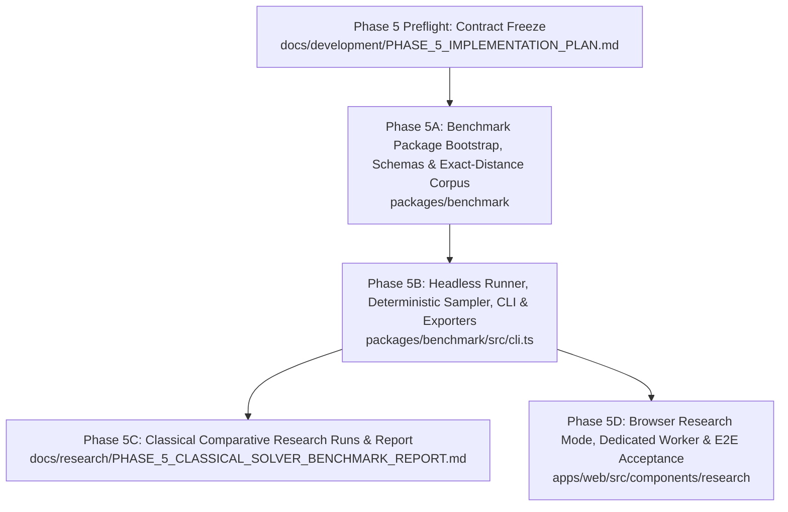

# PHASE_5_IMPLEMENTATION_PLAN.md — Research & Benchmarking Harness

> **Document Status:** `PHASE5_PREFLIGHT_CANDIDATE`
> **Authoritative Main Baseline:** `11eb3f3bfa33e3e9802ff81c8cc4bf6580ed360a`
> **Branch:** `phase/5-benchmark-preflight`
> **Implementation Started:** `NO`
> **Phase 5 Accepted:** `NO`

---

## 1. Executive Summary & Purpose

Phase 5 establishes a rigorous, reproducible, and deterministic empirical research and benchmarking harness for the GearCube Lab framework. This system enables comparative evaluation of graph search algorithms (uninformed BFS, bidirectional BFS, IDA* with pattern database heuristics, and future learned heuristics) across exact-distance-stratified benchmark suites.

This preflight implementation plan freezes all architectural boundaries, type contracts, sampling methodologies, export schemas, execution layers, and subphase acceptance criteria **before** any benchmark implementation begins.

---

## 2. Governance & Policy Context

- **Applicability:** Pure TypeScript benchmark engine, Node CLI adapter, and browser Research Mode web worker architecture.
- **Puzzle Truth Axiom:** `@gearcube/core` remains the sole, immutable source of puzzle truth. The benchmark subsystem never owns or defines puzzle mechanics.
- **Solver Contract Decoupling:** Benchmarks evaluate algorithms exposed through `@gearcube/solvers` using canonical contracts (`solveBfs`, `solveBidirectionalBfs`, `solveIdaStar`).
- **Isolation Axiom:** Heavy benchmark search runs never execute synchronously on the browser UI main thread.

---

## 3. Resolution of Phase 5 Preflight Decisions (Questions A–N)

| Decision ID | Topic | Preflight Resolution & Contract Freeze |
| :--- | :--- | :--- |
| **A** | Package Boundary | `@gearcube/benchmark` depends directly on `@gearcube/core` and `@gearcube/solvers`. Zero 3rd-party runtime dependencies. Pure TypeScript. |
| **B** | Corpus Ownership | `packages/benchmark` owns benchmark corpus and case generation, building an independent exact-distance index via `@gearcube/core` without importing solver tests or private codec internals. |
| **C** | Suite / Case Schema | Versioned `BenchmarkSuiteConfig` (`schemaVersion: "1"`), `BenchmarkCase`, `BenchmarkTrialResult`, `BenchmarkSummary`, and `BenchmarkReport`. |
| **D** | Seed Semantics | Seed is a `string` (empty string valid), normalized via FNV-1a (32-bit integer hash) feeding a deterministic Mulberry32 PRNG. |
| **E** | Sampling Policy | Stratified sampling by exact canonical distance ($d \in [1 \dots 8]$), selecting $K$ unique cases per depth without replacement from lexicographically sorted candidate state keys. Depth 0 is an optional control case. |
| **F** | Metric Schema | Formal separation of deterministic search metrics (`nodesExpanded`, `nodesGenerated`, `solutionDepth`, `status`, `limitReason`) from observational performance metrics (`elapsedMs`, memory, hardware environment). |
| **G** | Metric Determinism | Deterministic fields must match bit-for-bit across identical runs. Observational fields are excluded from bit-for-bit equality gates. |
| **H** | Timing Treatment | `elapsedMs` is recorded as an observational research metric. No absolute wall-clock timing gates in preflight or cross-machine CI. |
| **I** | Memory Methodology | Memory measurement is `OPTIONAL / OBSERVATIONAL`. If unavailable on the platform, reported as `NOT_AVAILABLE` (never fabricated as 0). |
| **J** | Warm-Up / Repetition | `warmupRuns >= 0` (discarded from summary statistics) and `measuredRuns >= 1` (all recorded as individual trials). |
| **K** | Resource Limits | Supported limits match solver options: `maxNodes` (optional number) and `maxDepth` (optional number). No artificial timeout contract. |
| **L** | Export Formats | Lossless, versioned JSON export and flat, per-trial CSV export with deterministic column ordering. |
| **M** | Execution Boundaries | Three strictly isolated layers: (1) Pure Benchmark Engine (`packages/benchmark`), (2) Node CLI Adapter (`packages/benchmark/src/cli.ts`), and (3) Browser Research Mode (`apps/web` via dedicated Web Worker). |
| **N** | Reference Environment | System/hardware metadata (CPU, OS, Node/browser version) captured as non-normative provenance. Proposed targets (60 FPS, sub-1ms) remain non-binding performance goals until reference profiles are established. |

---

## 4. System Architecture & Component Topology

```
+---------------------------------------------------------------------------------------------------+
|                                     GEARCUBE LAB ECOSYSTEM                                        |
|                                                                                                   |
|  [ apps/web ] (Presentation Layer)                                                                |
|    ├── Play Mode UI (Implemented - Phase 3)                                                       |
|    ├── Solve Mode UI & Solver Worker (Implemented - Phase 4)                                      |
|    └── Research Mode UI & Dedicated Benchmark Worker (Phase 5D)                                   |
|              │                                                                                    |
|              ▼ (Dispatches Benchmark Jobs off UI Thread)                                          |
|  [ Dedicated Browser Worker Adapter ] (apps/web/src/workers/benchmark.worker.ts)                   |
|              │                                                                                    |
|              ▼                                                                                    |
|  [ Pure Benchmark Engine ] (@gearcube/benchmark — packages/benchmark)                             |
|    ├── Corpus Builder (Core-only exhaustive exact-distance traversal)                             |
|    ├── Deterministic Stratified Sampler (FNV-1a + Mulberry32)                                     |
|    ├── Benchmark Runner & Metric Aggregator                                                       |
|    └── JSON / CSV Exporters                                                                       |
|         │                                │                                                        |
|         │ (Orchestrates Search)          │ (Validates States & Exact Traversal)                   |
|         ▼                                ▼                                                        |
|  [ Pure Solver Engine ]          [ Discrete Domain Core ]                                         |
|  (@gearcube/solvers)             (@gearcube/core)                                                 |
|    ├── BFS Solver                      ├── Canonical State Types (`GearCubeState`)                |
|    ├── Bidirectional BFS               ├── Transition Functions (`applyMove`)                     |
|    └── IDA* (H2 PDB Heuristic)         └── Canonical Codecs (`serializeLogicalState`)             |
|                                                                                                   |
|  [ Node CLI Adapter ] (packages/benchmark/src/cli.ts)                                            |
|    └── Headless terminal runner executing @gearcube/benchmark with filesystem export             |
+---------------------------------------------------------------------------------------------------+
```

### 4.1. Dependency Axioms
1. `packages/benchmark` $\longrightarrow$ `@gearcube/core`
2. `packages/benchmark` $\longrightarrow$ `@gearcube/solvers`
3. `apps/web` $\longrightarrow$ `@gearcube/benchmark` (for Research Mode types and browser worker imports)
4. `packages/benchmark` has **zero** runtime dependencies on `apps/web`, React, Three.js, DOM, or Node built-in modules in its core engine entry.

---

## 5. Benchmark Contracts & Data Schemas

### 5.1. Configuration Schema (`BenchmarkSuiteConfig`)

```typescript
export interface BenchmarkSuiteConfig {
  readonly schemaVersion: '1';
  readonly suiteId: string;
  readonly seed: string;
  readonly exactDepths: readonly number[]; // e.g. [1, 2, 3, 4, 5, 6, 7, 8]
  readonly casesPerDepth: number;          // e.g. 5
  readonly algorithms: readonly ('BFS' | 'BIDIRECTIONAL_BFS' | 'IDA_STAR')[];
  readonly warmupRuns: number;             // default: 0
  readonly measuredRuns: number;           // default: 1
  readonly limits?: {
    readonly maxNodes?: number;
    readonly maxDepth?: number;
  };
}
```

### 5.2. Benchmark Case Schema (`BenchmarkCase`)

```typescript
export interface BenchmarkCase {
  readonly caseId: string;       // Deterministic ID, e.g. "d3_c0"
  readonly stateKey: string;     // Canonical serializeLogicalState string
  readonly exactDepth: number;   // True mathematical distance from solved state (1..8)
}
```

### 5.3. Trial Result Schema (`BenchmarkTrialResult`)

```typescript
export interface BenchmarkTrialResult {
  // Deterministic Identifiers
  readonly caseId: string;
  readonly exactDepth: number;
  readonly algorithm: 'BFS' | 'BIDIRECTIONAL_BFS' | 'IDA_STAR';
  readonly repetitionIndex: number; // 0-indexed measured run index
  readonly isWarmup: boolean;

  // Deterministic Search Metrics
  readonly status: 'SOLVED' | 'LIMIT_REACHED' | 'ERROR';
  readonly solutionDepth?: number;
  readonly solutionMoves?: readonly string[]; // Array of canonical Move strings e.g. ["F_CW", "R_CCW"]
  readonly nodesExpanded: number;
  readonly nodesGenerated: number;
  readonly limitReason?: 'MAX_NODES' | 'MAX_DEPTH';

  // Observational Performance Metrics
  readonly elapsedMs: number;
  readonly memoryBytes?: number | 'NOT_AVAILABLE';
}
```

### 5.4. Summary & Aggregate Schema (`BenchmarkSummary`)

```typescript
export interface AlgorithmSummaryByDepth {
  readonly exactDepth: number;
  readonly totalTrials: number;
  readonly solvedCount: number;
  readonly limitCount: number;
  readonly meanNodesExpanded: number;
  readonly medianNodesExpanded: number;
  readonly meanNodesGenerated: number;
  readonly medianNodesGenerated: number;
  readonly meanElapsedMs: number;
  readonly medianElapsedMs: number;
}

export interface AlgorithmSummary {
  readonly algorithm: 'BFS' | 'BIDIRECTIONAL_BFS' | 'IDA_STAR';
  readonly byDepth: readonly AlgorithmSummaryByDepth[];
  readonly totalSolved: number;
  readonly totalLimits: number;
  readonly overallMeanNodesExpanded: number;
  readonly overallMedianElapsedMs: number;
}

export interface BenchmarkSummary {
  readonly totalCases: number;
  readonly totalTrials: number;
  readonly algorithms: readonly AlgorithmSummary[];
}
```

### 5.5. Full Report Schema (`BenchmarkReport`)

```typescript
export interface EnvironmentProvenance {
  readonly platform: 'node' | 'browser';
  readonly userAgent?: string;
  readonly nodeVersion?: string;
  readonly os?: string;
  readonly cpuModel?: string;
  readonly logicalCores?: number;
  readonly executionTimestamp: string;
}

export interface BenchmarkReport {
  readonly schemaVersion: '1';
  readonly config: BenchmarkSuiteConfig;
  readonly environment: EnvironmentProvenance;
  readonly cases: readonly BenchmarkCase[];
  readonly trials: readonly BenchmarkTrialResult[];
  readonly summary: BenchmarkSummary;
}
```

---

## 6. Deterministic Exact-Distance Corpus & Stratified Sampling

### 6.1. Independent Corpus Generation
To guarantee that benchmark case classification is independent from the solvers being evaluated:
1. `packages/benchmark` implements an independent, Core-only BFS traversal starting from `SOLVED_GEAR_CUBE_STATE`.
2. The traversal explores transitions exclusively using `@gearcube/core` `applyMove` and `ALL_MOVES`.
3. States are tracked by canonical `serializeLogicalState(state)`.
4. Traversal discovers exactly **41,472** canonical states and partitions them into 9 exact-distance buckets ($d = 0 \dots 8$).
5. Maximum exact diameter is verified as exactly **8**.
6. This index generation occurs outside measured solver trials and is not included in solver counters.

### 6.2. Deterministic Sampling Algorithm
For a given `seed: string`, `exactDepths: number[]`, and `casesPerDepth: number`:
1. Hash the seed string to a 32-bit unsigned integer using **FNV-1a**.
2. Initialize a **Mulberry32** PRNG instance with this seed hash.
3. For each requested exact depth $d$:
   - Retrieve all candidate state keys in distance bucket $d$.
   - Sort the candidate state keys in lexicographical string order (ensures platform-independent baseline ordering).
   - Sample $K = \text{casesPerDepth}$ indices without replacement using the PRNG stream.
   - Assign deterministic case IDs: `d<d>_c<0..K-1>`.
4. Same config + same seed $\Longrightarrow$ identical case IDs, state keys, and order across all platforms.

---

## 7. JSON & CSV Export Specifications

### 7.1. Lossless JSON Export
- Contains complete `BenchmarkReport` structure.
- Serialized with 2-space indentation.
- Includes `schemaVersion: "1"`.

### 7.2. Flat Per-Trial CSV Export
- One header row followed by one data row per **measured trial** (warm-up trials excluded).
- **Exact Column Order:**
  ```text
  schemaVersion,suiteId,seed,caseId,exactDepth,algorithm,repetitionIndex,status,solutionDepth,solutionMoves,nodesExpanded,nodesGenerated,limitReason,elapsedMs
  ```
- **Encoding Rules:**
  - `solutionMoves`: Space-separated canonical move identifiers (e.g. `"F_CW R_CCW U_CW"`) or empty string if unsolved.
  - `limitReason`: String representation (`"MAX_NODES"`, `"MAX_DEPTH"`) or empty string if not limited.
  - No `[object Object]` or unescaped comma leakage.

---

## 8. Subphase Decomposition & Execution Plan



### 8.1. Phase 5A: Package Bootstrap, Schemas & Exact-Distance Corpus
- **Objective:** Create `packages/benchmark`, define pure TypeScript schemas, and implement the independent Core-only exact-distance corpus builder.
- **Deliverables:**
  - `packages/benchmark/package.json` (zero 3rd-party dependencies, workspace deps: `@gearcube/core`, `@gearcube/solvers`).
  - `packages/benchmark/src/types.ts` (suite, case, trial, report, summary interfaces).
  - `packages/benchmark/src/corpus.ts` (independent Core-only traversal discovering 41,472 states and diameter 8).
  - Vitest test suites verifying corpus completeness, diameter, and package boundary.
- **Acceptance Gates:**
  - `BENCHMARK_PACKAGE_BOUNDARY_GATE`: Dependencies strictly limited to `@gearcube/core` and `@gearcube/solvers`.
  - `CORE_TRUTH_GATE`: No local puzzle transition logic in benchmark package.
  - `EXACT_DISTANCE_CORPUS_CLOSURE_GATE`: Discovers exactly 41,472 reachable states.
  - `EXACT_DISTANCE_DIAMETER_GATE`: Maximum exact distance verified as 8.

### 8.2. Phase 5B: Headless Runner, Deterministic Sampling, CLI & Exporters
- **Objective:** Implement deterministic FNV-1a + Mulberry32 stratified sampling, algorithm orchestration runner, JSON/CSV exporters, and Node CLI adapter.
- **Deliverables:**
  - `packages/benchmark/src/sampler.ts` (deterministic exact-distance sampling).
  - `packages/benchmark/src/runner.ts` (multi-algorithm comparative trial runner).
  - `packages/benchmark/src/export.ts` (JSON and CSV serialization).
  - `packages/benchmark/src/cli.ts` (Node CLI executable adapter).
  - Vitest tests for determinism, export round-trips, and solver optimality.
- **Acceptance Gates:**
  - `REPEATED_RUN_DETERMINISM_GATE`: Identical suite config + seed yields bit-for-bit identical cases, paths, depths, node counts, and statuses.
  - `OPTIMALITY_GATE`: For all solved exact-distance cases, `solutionDepth === exactDepth` for BFS, BiBFS, and IDA*.
  - `JSON_EXPORT_ROUNDTRIP_GATE`: JSON export validates against schema and recovers all case/trial fields.
  - `CSV_SCHEMA_GATE`: CSV matches exact 14-column specification with valid move strings.
  - `CLI_HEADLESS_GATE`: Node CLI executes and emits reports without errors.
  - `ALGORITHM_FAIRNESS_GATE`: BFS, BiBFS, and IDA* evaluated on identical case instances with identical limits.

### 8.3. Phase 5C: Classical Comparative Research Runs & Report
- **Objective:** Execute standard comparative benchmark suites across depths 1..8 and publish an empirical research report analyzing search node expansion, branch pruning, and time profiles.
- **Deliverables:**
  - Comparative evaluation datasets (JSON and CSV).
  - `docs/research/PHASE_5_CLASSICAL_SOLVER_BENCHMARK_REPORT.md`.
- **Acceptance Gates:**
  - `RESEARCH_DATASET_GATE`: Full comparative data collected across BFS, BiBFS, and IDA* for depths 1..8.
  - `METRIC_SEPARATION_GATE`: Report clearly separates deterministic search tree efficiency from observational execution times.
  - `REPRODUCIBILITY_GATE`: Benchmark suite config and seed documented enabling exact reproduction.

### 8.4. Phase 5D: Browser Research Mode, Dedicated Worker & E2E Acceptance
- **Objective:** Integrate Research Mode into `apps/web` with a dedicated Web Worker adapter, real-time progress indicators, summary tables, and JSON/CSV file downloads.
- **Deliverables:**
  - `apps/web/src/workers/benchmark.worker.ts` (dedicated background worker for benchmarks).
  - `apps/web/src/components/research/ResearchPanel.tsx` (suite configuration, start/cancel, progress, results).
  - Mode toggle integration in main navigation header.
  - Playwright browser E2E test suite (`tests/e2e/research-mode.spec.ts`).
  - Interactive Chrome DevTools acceptance verification.
- **Acceptance Gates:**
  - `RESEARCH_WORKER_ISOLATION_GATE`: Benchmark compute executes off the UI thread; UI remains interactive.
  - `BENCHMARK_CANCELLATION_GATE`: Active benchmark can be cancelled cleanly without hanging the UI or worker.
  - `EXPORT_DOWNLOAD_GATE`: JSON and CSV download actions generate valid downloadable blobs in browser.
  - `PLAYWRIGHT_RESEARCH_E2E_GATE`: Automated Playwright test passes across desktop, tablet, and mobile viewports.
  - `INTERACTIVE_BROWSER_GATE`: Chrome DevTools live verification of viewport rendering, controls, and zero console errors.

---

## 9. Non-Functional & Performance Verification Policy

- **Target Framing:** Sub-1ms discrete transitions and 60 FPS rendering are classified as **Proposed Observational Performance Targets**.
- **Cross-Platform Rule:** Deterministic acceptance gates never fail on clock-dependent wall times (`elapsedMs`) or platform-specific memory metrics.
- **Fairness Guarantee:** When comparing BFS, BiBFS, and IDA*, all algorithms are executed on identical hardware under identical runtime conditions with identical case batches.

---

## 10. Summary Verification & Acceptance Checklist

| Gate / Invariant | Verification Method | Pass Requirement |
| :--- | :--- | :--- |
| **Package Isolation** | Boundary Test (`tests/boundary.test.ts`) | `@gearcube/benchmark` depends only on Core and Solvers. Zero UI/DOM deps. |
| **Corpus Completeness** | Unit Test (`corpus.test.ts`) | Exactly 41,472 canonical states; maximum diameter 8. |
| **Sampling Determinism** | Unit Test (`sampler.test.ts`) | Same seed + config $\Longrightarrow$ identical case array. |
| **Search Determinism** | Unit Test (`runner.test.ts`) | Bit-for-bit identical `nodesExpanded`, `nodesGenerated`, `solutionMoves`. |
| **Solution Optimality** | Unit Test (`runner.test.ts`) | `solutionDepth === exactDepth` for all solved canonical cases. |
| **Export Integrity** | Unit Test (`export.test.ts`) | Lossless JSON round-trip and exact 14-column CSV structure. |
| **CLI Functionality** | Integration Test (`cli.test.ts`) | Headless CLI writes valid JSON/CSV outputs to disk. |
| **Browser Isolation** | Playwright E2E (`research-mode.spec.ts`) | Worker executes off main thread; responsive UI during run. |
